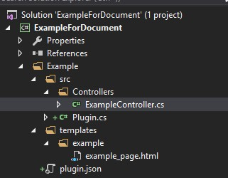
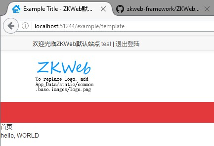
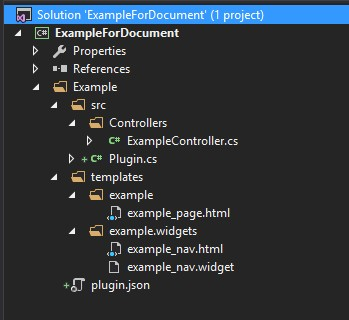
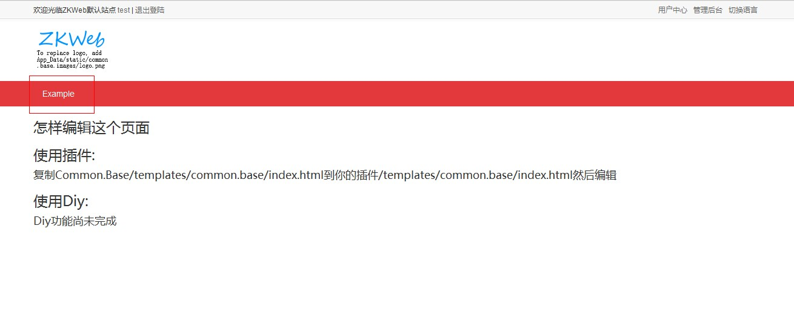

ZKWeb使用了独自编写的控制器和模板系统，不依赖于asp.net webform和mvc。<br/>
在ZKWeb中控制器接口只是一个空接口，自身不拥有状态。<br/>
获取当前http上下文可以通过`HttpContextUtils.CurrentContext`，<br/>
为了更好的支持单元测试，请不要使用`HttpContext.Current`。<br/>

### <h2>添加控制器</h2>

添加`Example\src\Controllers\ExampleController.cs`，内容如下</br>
使用`Controllers`文件夹保存控制器代码是命名习惯，不是必须遵从的。</br>

``` csharp
/// <summary>
/// 示例使用的控制器
/// </summary>
[ExportMany]
public class ExampleController : IController {
	[Action("example/plain_text")]
	public string PlainTextAction() {
		return "hello world on zkweb";
	}
}
```

保存后在浏览器中打开`http://localhost:端口/example/plain_text`，即可看到返回的内容。</br>
控制器中标记了`[Action]`属性的函数都是可以访问的函数，返回类型可以是`string`或`IActionResult`。</br>
在Action属性中可以指定路径和请求类型(GET或POST)，路径前面如果没有`/`会自动补上。</br>
和mvc不一样，ZKWeb的路径完全由Action属性而不是控制器决定，而且处理函数必须标记Action属性。</br>

### <h2>模板页介绍</h2>

ZKWeb的模板系统使用了DotLiquid。</br>
请先参考DotLiquid的文档:</br>
http://dotliquidmarkup.org/</br>

使用它代替cshtml的原因有</br>

- 模板只要求参数不要求环境，可以纯粹当成是字符串模板使用
- 模板只编译成语法树而不是IL代码，每个页面第一次打开的速度远比cshtml要快
- 没有内存泄漏的问题（可以在网站运行时不断更新模板页）

### <h2>使用模板页</h2>

在上面的`ExampleController`下添加以下代码

``` csharp
[Action("example/template")]
public IActionResult TemplateAction() {
	return new TemplateResult("example/example_page.html", new { text = "world" });
}
```

在`Example`文件夹下创建`templates\example`文件夹，并添加`example_page.html`文件，内容如下
``` html
<p>hello, {{ arg }}</p>
```

完成后的目录结构应该如下</br>


保存后在浏览器中打开`http://localhost:端口/example/template`，即可看到`hello, world`。</br>

### <h2>模板标签和过滤器</h2>

模板支持自定义的标签和过滤器。</br>
标签的格式是``</br>
过滤器的格式是`{{ 变量或常量 | 过滤器 | 过滤器: 参数,参数 | 更多过滤器... }}`</br>

修改上面的模板页内容:</br>

``` html



<div>{{ "HomePage" | trans }}</div>
<div>hello, {{ text | upcase }}</div>


```

刷新页面可以看到以下的效果:</br>


### <h2>框架自带的返回类型</h2>

框架提供了以下的返回类型，</br>
如果需要返回其他类型的结果，可以自己编写继承`IActionResult`的类。</br>

- `FileResult(string path, DateTime? ifModifiedSince = null)`
- `ImageResult(Image image, ImageFormat format = null)`
- `JsonResult(object obj, Formatting formatting = Formatting.None)`
- `PlainResult(object obj)`
- `RedirectResult(string url, bool permanent = false)`
- `StreamResult(Stream stream, string contentType = null)`
- `TemplateResult(string path, object argument = null)`

### <h2>框架自带的标签和过滤器</h2>

框架自带了以下的标签<br/>

- area
	- 描画区域，参考"动态内容"
	- 例: ``
- fetch
	- 把指定路径的执行结果设置到变量
	- 例: ``
- html_lang
	- 显示当前的页面语言代号
	- 例: ``
- raw_html
	- 描画原始的内容，不经过html编码
	- 例: ``

框架自带了以下的过滤器<br/>

- trans
	- 翻译指定的文本
	- 例: `, `
- format
	- 格式化字符串，最多可支持8个参数
	- 例: `{{ "name is [0], age is [1]" | format: name, age }}`

### <h2>获取请求参数</h2>

使用`HttpContextUtils.CurrentContext.Request`可以获取到请求对象并获取里面的参数。</br>
目前ZKWeb不能像mvc那样通过函数参数来获取请求参数，但很多情况下不需要自己获取。</br>
获取请求参数的例子: </br>

``` csharp
var request = HttpContextUtils.CurrentContext.Request;
var id = request.Get<int>("id"); // a collection combines Form and Request
var file = request.Files[0];
```

### <h2>重载处理函数</h2>

ZKWeb支持在一个插件中替换另一个插件的处理函数。</br>
例如插件A定义了"example/a"，插件B也定义了同样路径的函数，ZKWeb会使用插件B中定义的函数。</br>
这个功能可以用于编写自己的插件替换掉整个首页或登陆页面。</br>
重载处理函数时需要指定"OverrideExists"参数，否则会提示冲突。</br>
``` csharp
[Action("example/a", OverrideExists = true)]
public IActionResult ExampleAInPluginB() { ... }
```

### <h2>重载模板</h2>

ZKWeb支持在一个插件中替换另一个插件的模板文件，这点和Django一样。</br>
以下的目录结构，插件B在插件A后面加载时，插件B的模板页会替换到插件A的模板页。</br>

- Plugins
	- A
		- templates
			- a
				- some_page.html (不会使用)
	- B
		- templates
			- a
				- some_page.html (会使用)

模板还可以通过`App_Data\templates`重载，结构和上面一样。</br>
支持模板的重载可以让新的插件随意更换原有插件的网页内容，也可以提供一套用户编辑的系统编辑所有页面。</br>

### <h2>设备专用模板</h2>

ZKWeb支持手机访问时优先读取手机版专用的模板<br/>
手机专用的模板保存在templates.mobile下。<br/>
以下的目录结构，在手机访问时会优先使用手机版专用的模板。</br>

- Plugins
	- A
		- templates
			- a
				- some_page.html (不会使用)
		- templates.mobile
			- a
				- some_page.html (会使用)

### <h2>模板查找规则</h2>

完整的模板查找规则如下

- 显式指定插件，这时不允许从其他插件或App_Data重载模板
	- "所在插件:模板路径"
	- 例 "Common.Base:include/header.html"
	- 模板路径
		- 插件目录\templates.{device}\模板路径
		- 插件目录\templates\模板路径
		- 显式指定插件通常用于模板的继承

- 不指定插件，允许其他插件或App_Data重载模板
	- "模板路径"
	- 例 "include/header.html"
	- 查找模板路径的顺序
		- App_Data\templates.{device}\模板路径
		- 按载入顺序反向枚举插件
			- 插件目录\templates.{device}\模板路径
		- App_Data\templates\模板路径
		- 按载入顺序反向枚举插件
			- 插件目录\templates\模板路径

### <h2>动态内容</h2>

考虑到实现可视化编辑（动态拖拽和修改页面内容），ZKWeb提供了一套默认的动态内容系统。</br>

这套系统定义了以下的类型<br/>

- 区域 (area)
- 模块 (widget)

每个区域下可以有多个模块，但区域不能嵌套区域。<br/>
可视化编辑时可以拖动模块加入区域，模块可以通过自定义的参数调整里面的内容。<br/>

在模板页中使用``时会查找这个区域下的所有模块并加入到里面。<br/>
查找顺序是<br/>

- App_Data\areas\\{区域Id}.widgets
- 程序中注册的默认模块列表

区域Id全局唯一，请注意是否会产生冲突。</br>
全局唯一的理由是，有的区域（例如网站头部）是整个网站共享的，这时只需要编辑这个区域就可以应用到所有页面。</br>

### <h2>添加链接到导航栏</h2>

在默认的插件中提供了一个导航栏区域，名称是`header_menubar`。</br>
下面演示怎样添加链接到这个区域中。</br>

在`Plugin`类的`Plugin()`函数下添加以下代码:</br>
``` csharp
var areaManager = Application.Ioc.Resolve<TemplateAreaManager>();
areaManager.GetArea("header_menubar").DefaultWidgets.Add("example.widgets/example_nav");
```

创建`Example\templates\example.widgets\example_nav.widget`，并添加以下内容
``` json
{ "Name": "Example Navbar Item" }
```

创建`Example\templates\example.widgets\example_nav.html`，并添加以下内容
```html
<ul class="nav">
	<li><a href="/example/template">{{ "Example" }}</a></li>
</ul>
```

添加后文件结构应该如下:</br>


刷新页面可以看到以下的效果:</br>


### <h2>模板模块的单独缓存</h2>

模板模块支持设置单独的缓存时间和缓存策略，使用此功能可以大幅提高页面的响应速度。<br/>
在widget文件指定缓存时间，例如<br/>
``` json
{
	"Name": "Example Navbar Item",
	"CacheTime": 15,
	"CacheBy": "Locale"
}
```

这里的CacheTime表示该模块的描画结果会缓存15秒，CacheBy表示缓存的隔离策略。<br/>
这里缓存会按当前的语言和时区来隔离。<br/>
缓存的隔离策略可以通过实现`ICacheIsolationPolicy`接口添加。<br/>
目前`Common.Base`插件提供了多种缓存的隔离策略，请参考该插件的文档。<br/>
