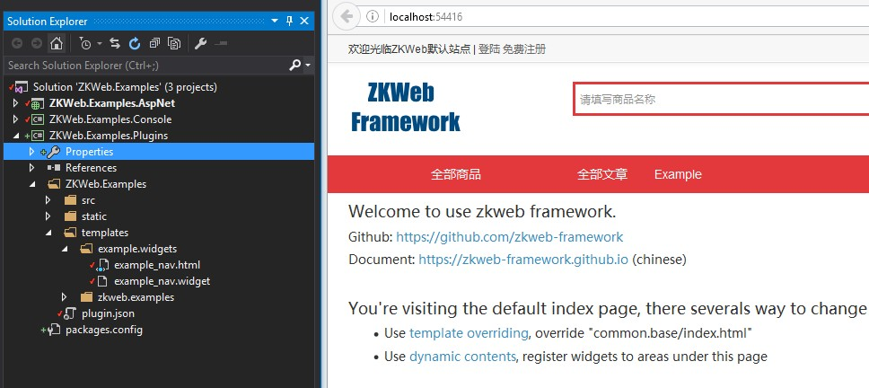

考虑到实现可视化编辑（动态拖拽和修改页面内容），ZKWeb提供了一套默认的动态内容系统。</br>

这套系统定义了以下的类型<br/>

- 区域 (area)
- 模块 (widget)

每个区域下可以有多个模块，但区域不能嵌套区域。<br/>
可视化编辑时可以拖动模块加入区域，模块可以通过自定义的参数调整里面的内容。<br/>

### 使用区域

在模板中使用`area`标签，可以描画注册到这个区域下的所有模块
```html

```

### 区域下的模块列表

每个区域下都有对应的模块列表，模块列表的查找顺序如下

- `App_Data\areas\{区域Id}.widgets`
- 程序中注册的默认模块列表

区域Id全局唯一，请注意是否会产生冲突。</br>
全局唯一的理由是，有的区域（例如网站头部）是整个网站共享的，这时只需要编辑这个区域就可以应用到所有页面。</br>

### 注册模块到默认模块列表中

使用默认的插件集时，会在头部中描画标签``，
这里演示怎样添加自定义的模块到这个区域中。

在`Plugin.cs`的`Plugin()`函数下添加以下代码:</br>
``` csharp
var areaManager = Application.Ioc.Resolve<TemplateAreaManager>();
areaManager.GetArea("header_menubar").DefaultWidgets.Add("example.widgets/example_nav");
```

创建`templates/example.widgets/example_nav.widget`，并添加以下内容
``` json
{ "Name": "Example Navbar Item" }
```

创建`templates/example.widgets/example_nav.html`，并添加以下内容
```html
<ul class="nav">
	<li><a href="/example/template">{{ "Example" }}</a></li>
</ul>
```

添加以后刷新页面可以看到</br>


### 模块的单独缓存

模板模块支持设置单独的缓存时间和缓存策略，使用此功能可以大幅提高页面的响应速度。<br/>
在widget文件指定缓存时间，例如<br/>
``` json
{
	"Name": "Example Navbar Item",
	"CacheTime": 15,
	"CacheBy": "Locale,Url"
}
```

这里的`CacheTime`表示该模块的描画结果会缓存15秒，`CacheBy`表示缓存的隔离策略。<br/>
缓存策略请参考[缓存处理](cache)，这里缓存会按当前的语言和时区来隔离。<br/>
有多个缓存策略时可以用逗号分隔，为了兼容设备专用模板，默认会自动添加"Device"策略。<br/>
