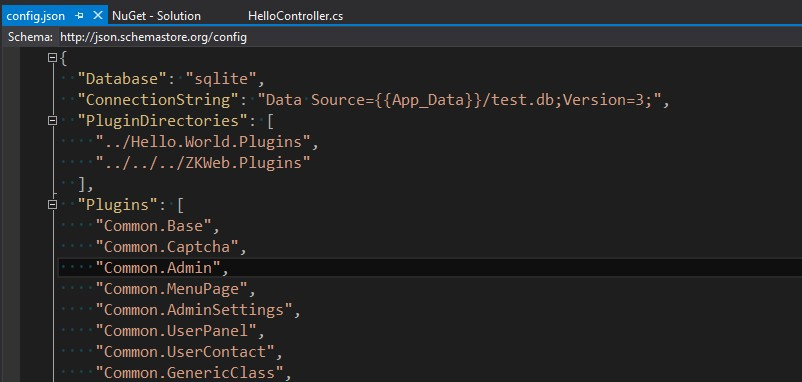
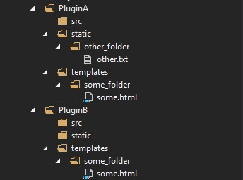

ZKWeb中的插件以文件夹为单位，插件的编译由框架完成，不依赖Visual Studio。<br/>
ZKWeb会自动检测插件文件是否有修改，如果有修改则自动重新编译。<br/>

### 插件的查找和加载

ZKWeb会根据`App_Data\config.json`中的`PluginDirectories`对插件进行查找。<br/>
加载时会按`Plugins`中定义的顺序进行加载。<br/>


使用上面的配置时<br/>
如果项目在`D:\Projects\Hello.World\src\Hello.World`，将会尝试从以下的路径载入`Common.Base`插件<br/>

- `D:\Projects\ZKWeb.Plugins\Common.Base`
- `D:\Projects\Hello.World\src\Hello.World\Common.Base`

载入`Common.Base`插件后，会接着载入`Common.Captcha`插件，直到所有插件加载完毕。

### 插件信息

插件信息储存在`插件文件夹\plugin.json`中，格式如下。<br/>
``` json
{
	"Name": "插件名称",
	"Version":  "插件版本",
	"Description": "插件描述",
	"Dependencies": [ "依赖的其他插件" ],
	"References": [ "依赖的程序集" ]
}
```

### 依赖外部程序集

插件有时候需要依赖外部的程序集，但从Nuget安装的程序包不会被ZKWeb自动识别。<br/>
这时候就需要指定`plugin.json`中的`References`。<br/>
例如依赖`CsQuery`这个外部组件时，先复制`CsQuery.dll`到`插件文件夹\references`下，<br/>
然后添加`"CsQuery"`到`plugin.json`中的`References`即可。<br/>

CKEditor插件依赖外部程序集的例子


### 资源文件的读取顺序

ZKWeb使用了类似Django的重叠+透过式文件系统，一个插件可以简单的重载另外一个插件的资源文件。<br/>
读取资源文件的顺序如下，会返回最先存在的路径。<br/>
```
"App_Data/路径"
foreach (按加载顺序反序枚举插件) {
	"插件目录/路径"
}
```

例如`Plugins: [ "PluginA", "PluginB" ]`，目录结构如下时<br/>

读取资源`templates/some_folder/some.html`会读取`PluginB`下的文件，<br/>
读取资源`static/other_folder/other.txt`会读取`PluginA`下的文件。<br/>

获取资源文件可以使用以下的代码

``` csharp
var pathManager = Application.Ioc.Resolve<PathManager>();
var fullPath = pathManager.GetResourceFullPath("templates", "some_folder", "some.html");
```

### 组件的注册顺序

插件的载入顺序还会影响到组件的注册顺序，例如`Plugins: [ "PluginA", "PluginB" ]`，<br/>
插件`PluginA`有`[ExportMany]class ExampleHandlerA : IExampleHandler { }`，<br/>
插件`PluginB`有`[ExportMany]class ExampleHandlerB : IExampleHandler { }`，<br/>
这时使用`Application.Ioc.ResolveMany<IExampleHandler>()`会获取到`[ExampleHandlerA, ExampleHandlerB]`。

### 调试插件

调试在主项目内的插件很简单，直接F5运行并下断点即可。<br/>

调试在主项目外的插件有两种办法:

- 第一种
	- 在插件的VS中选择调试-挂载到进程并选择IIS进程或Kestrel进程挂载
	- Asp.Net和Owin选择`iisexpress.exe`
	- Asp.Net Core选择`项目主程序.exe`
- 第二种
	- 把需要调试的文件拖动到Visual Studio中，然后在里面下断点


