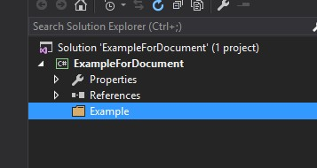

ZKWeb的插件系统以文件夹为单位，每个文件夹等于一个插件。<br/>
插件的编译由核心框架完成，不依赖VS。<br/>
下面使用VS创建插件是因为编写插件时可以有代码提示和调试支持。<br/>

### <h2>插件的目录结构</h2>

- ZKWeb.Plugins (默认的插件根目录)
	- Common.Base (插件文件夹)
	- Common.Admin (插件文件夹)
	- ...
- ZKWeb.Example (示例的插件根目录)
	- ExampleForDocument (插件文件夹)
		- bin (储存这个插件编译出来的dll文件)
		- src (储存代码文件，发布时可以把这个文件夹除外)
		- static (储存静态文件)
		- templates (储存模板文件)
	- OtherExample (插件文件夹)
		- 同上

在`config.json`的`PluginDirectories`可以指定一个或多个插件根目录。

### <h2>创建插件</h2>
步骤

- 打开Visual Studio，创建项目，类型选“类库”，名称填`ExampleForDocument`，不要勾选为解决方案创建文件夹。</p>
- 在项目中引用`ZKWeb\bin`下的所有dll
- 在项目下添加文件夹`Example`

创建后的目录结构应该如下:<br/>
ZKWeb.Example文件夹需要自己创建，或者使用github上现成项目。

- ZKWeb
- ZKWeb.Example
	- ExampleForDocument
		- Example



### <h2>引用插件</h2>
步骤

- 打开`ZKWeb\App_Data\config.json`
- 修改`PluginDirectories`，在后面添加`"../../ZKWeb.Examples/ExampleForDocument"`
- 修改`Plugins`，在后面添加`"Example"`
- 刷新浏览器，在后台中查看"关于网站"是否显示了这个插件，点击右上角图标会显示关于网站

引用插件时需要注意依赖顺序，在前面的插件会先加载。
这里的顺序也会影响到IoC容器中的注册顺序和模板文件的查找顺序。


### <h2>添加插件说明</h2>

在`Example`文件夹下创建`plugin.json`，内容如下
```
{
	"Name": "Example",
	"Description": "Example plugin for document"
}
```

刷新关于网站即可看到新的名称和说明。

### <h2>添加代码</h2>

插件的代码都保存在`src`文件夹下，可以参考文档顶部的目录结构。<br/>

这里添加在插件加载时输出日志的处理:<br/>
在src文件夹中创建Plugin.cs，内容如下（引用和命名空间省略，后面的文档也如此）<br/>

``` csharp
/// <summary>
/// 插件加载时输出一行日志
/// </summary>
[ExportMany]
public class Plugin : IPlugin {
	public Plugin() {
		var logManager = Application.Ioc.Resolve<LogManager>();
		logManager.LogDebug("Example plugin loaded");
	}
}
```

刷新浏览器，在App_Data/Logs下可以看到输出的日志。<br/>
ExportMany和Ioc将在下一节解释。<br/>

### <h2>Ioc容器</h2>

ZKWeb从0.9.5开始使用了自己编写的Ioc容器。<br/>
容器的接口说明: <br/>
<a href="https://github.com/zkweb-framework/ZKWeb/blob/master/ZKWeb.Utils/IocContainer/IRegistrator.cs" target="_blank">IRegistrator</a><br />
<a href="https://github.com/zkweb-framework/ZKWeb/blob/master/ZKWeb.Utils/IocContainer/IResolver.cs" target="_blank">IResolver</a><br />
<a href="https://github.com/zkweb-framework/ZKWeb/blob/master/ZKWeb.Utils/IocContainer/IGenericRegistrator.cs" target="_blank">IGenericRegistrator</a><br />
<a href="https://github.com/zkweb-framework/ZKWeb/blob/master/ZKWeb.Utils/IocContainer/IGenericResolver.cs" target="_blank">IGenericResolver</a><br />

ZKWeb全局使用的容器在`Application.Ioc`。<br/>
插件可以使用`[ExportMany]`或`[Export]`注册组件，也可以使用`IPlugin`接口在网站启动时注册到`Application.Ioc`中。<br/>
指定`[SingletonReuse]`属性时可以实现单例。<br/>
ZKWeb考虑到性能，内存占用和代码量，不使用构造函数注入。<br/>
单元测试时可以使用`Application.OverrideIoc`重载当前的容器。<br/>

ZKWeb在扫描类型时只会扫描公开的类型，如果类型标记了Export属性但是修饰符是private或者internal则不会被注册。<br/>

### <h2>Ioc容器的使用例子</h2>
以下是简单的使用例子。

``` csharp
void Example() {
	var animals = Application.Ioc.ResolveMany<IAnimal>()
	// animals contains instances of Dog and Cow
	
	var animalManager = Application.Ioc.Resolve<IAnimalManager>();
	// animalManager is AnimalManager
	
	var otherAnimalManager = Application.Ioc.Resolve<IAnimalManager>();
	// animalManager only create once, otherAnimalManager == animalManager
}
public interface IAnimal { }
[ExportMany] public class Dog : IAnimal { }
[ExportMany] public class Cow : IAnimal { }

public interface IAnimalManager { }
[ExportMany, SingletonUsage] public class AnimalManager : IAnimalManager { }
```

### <h2>组件注册顺序</h2>

插件的定义顺序会影响到组件注册顺序，例如`Plugins: [ "A", "B" ]`，<br/>
插件A有`class ExampleHandlerA : IExampleHandler { }`，<br/>
插件B有`class ExampleHandlerB : IExampleHandler { }`，<br/>
这时使用`Application.Ioc.ResolveMany<IExampleHandler>()`会获取到`[ExampleHandlerA, ExampleHandlerB]`。

### <h2>调试插件</h2>

调试插件有两种办法，<br/>
第一种是在插件的VS中选择调试-挂载到进程并选择IIS进程挂载。<br/>
第二种是把需要调试的文件拉到打开ZKWeb的VS中，然后在里面下断点。<br/>

