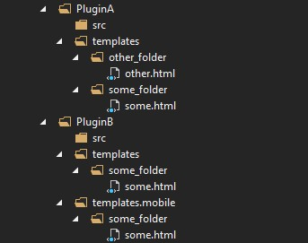

ZKWeb的模板系统使用了DotLiquid。</br>
请先参考DotLiquid的文档:</br>
http://dotliquidmarkup.org/</br>

### 代替Razor的原因

- DotLiquid的模板不要求拥有基类等复杂的环境，只需要传参数即可编译
- DotLiquid的模板只编译成语法树而不是IL代码，每个页面第一次打开的速度远比Razor要快
- 移植性好，目前已经兼容.net core（在ZKWeb的fork中）

### 模板的例子

``` html
<!DOCTYPE html>
<html>
<head>
	<title>Hello</title>
	
</head>
<body>
	<h1>Hello {{ text | upcase }}!</h1>
	
</body>
</html>
```


这里的``是标签，`|`是过滤器，使用`{{ }}`描画的内容会自动经过Html编码。</br>
`{{ }}`中可以使用变量或常量，`{{ variable }}`是变量，`{{ "constant" }}`是常量。</br>
标签的格式是``</br>
过滤器的格式是`{{ 变量或常量 | 过滤器 | 过滤器: 参数,参数 | 更多过滤器... }}`</br>

### 模板的路径

ZKWeb的模板作为特殊的资源文件管理，同时支持资源文件的重叠+透过式文件系统。</br>
如果还没有看过资源文件的说明，请先查看[插件系统](plugin)。</br>
ZKWeb的模板分为默认模板和设备专用模板，默认模板保存在`templates`文件夹下，设备专用模板保存在`templates.设备名下`。</br>
读取模板文件的顺序如下，会返回最先存在的路径。
```
"App_Data/templates.设备名/路径"
foreach (按加载顺序反序枚举插件) {
	"插件目录/templates.设备名/路径"
}
"App_Data/templates/路径"
foreach (按加载顺序反序枚举插件) {
	"插件目录/templates/路径"
}
```

例如`Plugins: [ "PluginA", "PluginB" ]`，目录结构如下时<br/>

在电脑上请求`some_folder/some.html`时，会返回到`PluginB/templates/some_folder/some.html`的内容。<br/>
在手机上请求`some_folder/some.html`时，会返回到`PluginB/templates.mobile/some_folder/some.html`的内容。<br/>
在电脑或手机上请求`other_folder/other.html`时，会返回到`PluginA/templates/other_folder/other.html`的内容。<br/>

如果需要获取指定插件下的模板，可以使用"插件:模板路径"，一般用于模板的继承。<br/>
使用以下路径时只会返回`PluginA`下的文件。<br/>
```
"PluginA:some_folder/some.html"
```

### 自带的标签和过滤器

ZKWeb框架中自带了以下的标签<br/>

- area
	- 描画区域，参考[动态内容](dynamic_contents)
	- 例: ``
- fetch
	- 把指定路径的执行结果设置到变量
	- 例: ``
- html_lang
	- 显示当前的页面语言代号
	- 例: ``
- raw_html
	- 描画原始的内容，不经过html编码
	- 例: ``

ZKWeb框架中自带了以下的过滤器<br/>

- trans
	- 翻译指定的文本，参考[多语言](multi_language)
	- 例: `{{ text | trans }}, {{ "fixed text" | trans }}`
- format
	- 格式化字符串，最多可支持8个参数
	- 例: `{{ "name is [0], age is [1]" | format: name, age }}`
- raw_html
	- 描画原始的内容，不经过html编码
	- 例: `{{ variable | raw_html }}`
