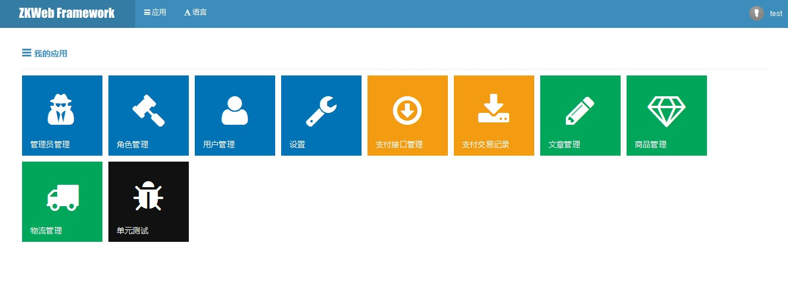

插件包含了用户和管理员所需的数据表，和最基础的后台管理页面。<br/>
支持快速开发使用的自动构建后台CRUD页面等功能。<br/>

### <h2>数据表</h2>

- 用户 (User)
- 角色 (UserRole)

一个用户可以对应多个角色，用户有用户类型，可以是普通用户或管理员或合作伙伴。

### <h2>用户注册和登陆</h2>

插件包含了用户注册和登陆页面，地址是

- 注册页面 /user/reg
- 登陆页面 /user/login

需要修改样式时可以重载相关的模板文件。

### <h2>权限</h2>

插件支持权限管理，网站中的权限由`IPrivilegesProvider`提供。<br/>
权限是一个字符串，格式推荐是`Group:Name`，例如`AdminManage:View`。<br/>
很多插件支持自动生成权限提供器，例如构建后台CRUD页面时会自动生成增删查改权限。<br/>

需要检查权限时可以使用`PrivilegesChecker`
``` csharp
PrivilegesChecker.Check(UserTypes[] types, params string[] privileges);
```

### <h2>后台页面</h2>

插件提供了默认的后台页面，地址是`/admin`，主题使用了AdminLTE。<br/>
网站创建后第一个登陆到后台的用户将会成为超级管理员。<br/>
后台包含一系列的后台功能，一个功能一个图标（如果自己替换模板页，可以换成别的形式）。<br/>


### <h2>添加后台功能</h2>

添加后台功能可以继承AdminApp类实现。<br/>
添加`Example\src\AdminApps\ExampleApp.cs`，内容如下
``` csharp
/// <summary>
/// 示例的后台应用
/// </summary>
[ExportMany]
public class ExampleApp : AdminApp {
	// Name和Url必须提供
	public override string Name { get { return "ExampleApp"; } }
	public override string Url { get { return "/admin/example_app"; } }
	// 可选，如果需要指定图标颜色和内容
	public override string TileClass { get { return "tile bg-navy"; } }
	public override string IconClass { get { return "fa fa-rocket"; } }
	// 可选，默认只要求管理员不要求指定权限
	public override UserTypes[] AllowedUserTypes { get { return UserTypesGroup.Admin; } }
	public override string[] RequiredPrivileges { get { return new[] { "ExampleApp:View" }; } }

	protected override IActionResult Action() {
		return new TemplateResult("example/example_admin_app.html");
	}
}
```

添加`Example\templates\example\example_admin_app.html`，内容如下
``` html


<div class="portlet-title">
	<div class="caption">
		<i class="fa fa-rocket"></i>
		<span class="caption-subject">{{ "Example Admin App" | trans }}</span>
	</div>
</div>
<div class="portlet-body">
	hello admin app
</div>

```

刷新后台可以看到多出了`ExampleApp`的图标<br/>


进入后会显示`Action`返回的内容<br/>


### 自动构建后台CRUD页面

插件提供了根据数据库中的数据快速构建后台CRUD页面的功能，构建时需要使用`AdminAppBuilder`。<br/>

添加`Example\src\AdminApps\ExampleCRUDApp.cs`，内容如下
``` csharp
/// <summary>
/// 示例的增删查改应用
/// </summary>
[ExportMany]
public class ExampleCRUDApp : AdminAppBuilder<ExampleTable, ExampleCRUDApp> {
	// Name和Url必须提供
	public override string Name { get { return "ExampleCRUDApp"; } }
	public override string Url { get { return "/admin/example_crud_app"; } }
	// 可选，如果需要指定图标颜色和内容
	public override string TileClass { get { return "tile bg-navy"; } }
	public override string IconClass { get { return "fa fa-rocket"; } }
	// 权限一般不需要手动指定，会根据名称生成"查看","修改","删除","永久删除"权限

	// 获取添加和编辑使用的表单
	protected override IModelFormBuilder GetAddForm() { return new Form(); }
	protected override IModelFormBuilder GetEditForm() { return new Form(); }

	// 获取搜索列表使用的回调
	protected override IAjaxTableCallback<ExampleTable> GetTableCallback() { return new TableCallback(); }

	/// <summary>
	/// 搜索列表使用的表格回调
	/// </summary>
	public class TableCallback : IAjaxTableCallback<ExampleTable> {
		public void OnBuildTable(AjaxTableBuilder table, AjaxTableSearchBarBuilder searchBar) {
			table.MenuItems.AddDivider(); // 右键菜单分割线
			table.MenuItems.AddEditActionForAdminApp<ExampleCRUDApp>(); // 右键编辑菜单项
			table.MenuItems.AddAddActionForAdminApp<ExampleCRUDApp>(); // 右键添加菜单项
			searchBar.KeywordPlaceHolder = new T("Name"); // 搜索栏的预留文本
			searchBar.MenuItems.AddDivider(); // 搜索栏的分割线
			searchBar.MenuItems.AddRecycleBin(); // 搜索栏的回收站菜单项
			searchBar.MenuItems.AddAddActionForAdminApp<ExampleCRUDApp>(); // 搜索栏的添加菜单项
		}

		public void OnQuery(
			AjaxTableSearchRequest request, DatabaseContext context, ref IQueryable<ExampleTable> query) {
			query = query.FilterByRecycleBin(request); // 按回收站过滤
			if (!string.IsNullOrEmpty(request.Keyword)) {
				query = query.Where(q => q.Name.Contains(request.Keyword)); // 按关键词过滤
			}
		}

		public void OnSort(
			AjaxTableSearchRequest request, DatabaseContext context, ref IQueryable<ExampleTable> query) {
			query = query.OrderByDescending(q => q.Id); // 按Id倒序排列
		}
		
		public void OnSelect(
			AjaxTableSearchRequest request, List<KeyValuePair<ExampleTable, Dictionary<string, object>>> pairs) {
			foreach (var pair in pairs) {
				pair.Value["Id"] = pair.Key.Id; // 选择Id
				pair.Value["Name"] = pair.Key.Name; // 选择名称
				pair.Value["CreateTime"] = pair.Key.CreateTime.ToClientTimeString(); // 选择创建时间
				pair.Value["Deleted"] = pair.Key.Deleted ? EnumDeleted.Deleted : EnumDeleted.None; // 选择删除状态
			}
		}

		public void OnResponse(
			AjaxTableSearchRequest request, AjaxTableSearchResponse response) {
			var idColumn = response.Columns.AddIdColumn("Id"); // Id列
			response.Columns.AddNoColumn(); // 序号列，页序号*页数量+数据位置(从1开始)
			response.Columns.AddMemberColumn("Name", "45%"); // 名称列
			response.Columns.AddMemberColumn("CreateTime"); // 添加时间列
			response.Columns.AddEnumLabelColumn("Deleted", typeof(EnumDeleted)); // 删除状态列
			var actionColumn = response.Columns.AddActionColumn(); // 操作列
			actionColumn.AddEditActionForAdminApp<ExampleCRUDApp>(); // 编辑按钮
			idColumn.AddDivider(); // 批量操作菜单的分割线
			idColumn.AddDeleteActionsForAdminApp<ExampleCRUDApp>(request); // 批量删除和恢复
		}
	}

	/// <summary>
	/// 添加和编辑使用的表单
	/// 内部使用GenericRepository.GetById获取和保存数据，如果主键成员不是"Id"请实现自定义的仓储类。
	/// </summary>
	public class Form : DataEditFormBuilder<ExampleTable, Form> {
		[Required]
		[StringLength(100)]
		[TextBoxField("Name", "Please enter name")]
		public string Name { get; set; }

		protected override void OnBind(DatabaseContext context, ExampleTable bindFrom) {
			Name = bindFrom.Name; // 绑定名称
		}

		protected override object OnSubmit(DatabaseContext context, ExampleTable saveTo) {
			saveTo.Name = Name; // 设置名称
			if (saveTo.Id <= 0) {
				saveTo.CreateTime = DateTime.UtcNow; // 设置创建时间
			}
			return new {
				message = new T("Saved successfully"), // 显示消息
				script = ScriptStrings.AjaxtableUpdatedAndCloseModal // 关闭模态框并刷新列表
			};
		}
	}
}
```

效果如图<br/>


自动生成的权限如图<br/>

