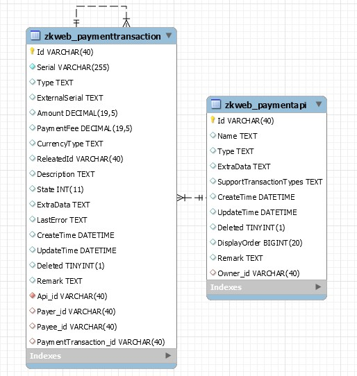
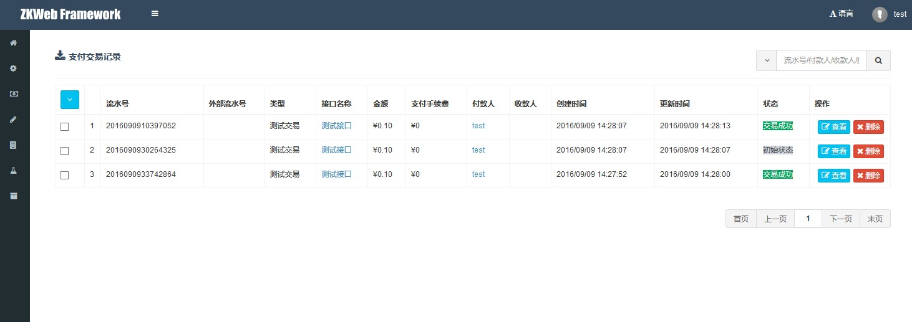

支付插件提供了通过各种收款接口（支付宝，财付通等）收取钱款的功能。<br/>
支付插件实现了交易（订单交易，充值交易等）和收款接口的分离，收款接口只需要实现统一的接口就能支持各种交易。

### 支付接口和交易的数据结构

TODO: 更新这张图


### 在后台管理支付接口

后台可以添加删除支付接口，并且可以设置每个支付接口的参数和可以使用的交易。<br/>


### 在后台管理支付交易

后台可以查看发起的交易记录，每笔交易都有对应的详细日志。


### 添加新的收款接口

添加收款接口需要继承`IPaymentApiHandler`。<br/>
以下是收款接口的示例代码，注意每种收款接口的处理流程都有不同，需要根据实际情况编写。<br/>
以支付宝为例<br/>

- 接口数据应该保存商家邮箱和密钥
- 获取支付Html时应该返回跳转到支付宝页面的html
- 调用发货接口时应该调用支付宝提供的发货api
- 同时还需要提供接收支付宝同步和异步通知的控制器
	- 收到交易开始，付款成功等通知后，应该调用交易管理器通知指定的交易处理

``` csharp
/// <summary>
/// 测试接口的处理器
/// </summary>
[ExportMany]
public class TestApiHandler : IPaymentApiHandler {
	/// <summary>
	/// 接口类型
	/// </summary>
	public string Type { get { return "TestApi"; } }
	/// <summary>
	/// 编辑中的接口数据
	/// </summary>
	protected ApiData ApiDataEditing = new ApiData();

	/// <summary>
	/// 后台编辑表单创建后的处理
	/// </summary>
	public void OnFormCreated(PaymentApiEditForm form) {
		form.AddFieldsFrom(ApiDataEditing);
	}

	/// <summary>
	/// 后台编辑表单绑定时的处理
	/// </summary>
	public void OnFormBind(PaymentApiEditForm form, PaymentApi bindFrom) {
		var apiData = bindFrom.ExtraData.GetOrDefault<ApiData>("ApiData") ?? new ApiData();
		ApiDataEditing.PaymentPassword = apiData.PaymentPassword;
	}

	/// <summary>
	/// 后台编辑表单保存时的处理
	/// </summary>
	public void OnFormSubmit(PaymentApiEditForm form, PaymentApi saveTo) {
		saveTo.ExtraData["ApiData"] = ApiDataEditing;
	}

	/// <summary>
	/// 计算支付手续费
	/// </summary>
	public void CalculatePaymentFee(PaymentApi api, decimal amount, ref decimal paymentFee) {
		paymentFee = 0;
	}

	/// <summary>
	/// 获取支付Html
	/// </summary>
	public void GetPaymentHtml(PaymentTransaction transaction, ref HtmlString html) {
		var templateManager = Application.Ioc.Resolve<TemplateManager>();
		var form = new TestApiPayForm(transaction);
		form.Bind();
		html = new HtmlString(templateManager.RenderTemplate("finance.payment/test_api_pay.html", new { form }));
	}

	/// <summary>
	/// 调用发货接口
	/// 发货后自动确认收货
	/// </summary>
	public void SendGoods(
		PaymentTransaction transaction, string logisticsName, string invoiceNo) {
		var logManager = Application.Ioc.Resolve<LogManager>();
		logManager.LogTransaction(string.Format(
			"PaymentApi send goods: transaction {0} logisticsName {1} invoiceNo {2}",
			transaction.Serial, logisticsName, invoiceNo));
		var transactionManager = Application.Ioc.Resolve<PaymentTransactionManager>();
		transactionManager.Process(transaction.Id, null, PaymentTransactionState.Success);
	}

	/// <summary>
	/// 接口数据
	/// </summary>
	public class ApiData {
		/// <summary>
		/// 支付密码
		/// </summary>
		[Required]
		[StringLength(100, MinimumLength = 5)]
		[PasswordField("PaymentPassword", "Password required to pay transactions")]
		public string PaymentPassword { get; set; }

		/// <summary>
		/// 检查支付密码是否和设置的密码一致
		/// </summary>
		public void CheckPaymentPassword(string paymentPassword) {
			if (string.IsNullOrEmpty(PaymentPassword) || paymentPassword != PaymentPassword) {
				throw new ForbiddenException(new T("Incorrect payment password"));
			}
		}
	}
}
```

### 添加新的交易类型

添加交易类型需要继承`IPaymentTransactionHandler`。<br/>
以下是测试交易的示例代码，注意需要根据每种交易的实际流程进行编写。<br/>
以订单交易为例<br/>

- 交易创建后: 不需要做特殊的处理，只需要记录到日志
- 等待付款时: 同上（在这个状态后订单金额应该不允许修改，否则有可能导致支付金额对不上）
- 担保交易付款后: 修改订单状态为等待发货，并在发货时调用支付接口的发货接口通知
- 交易成功时: 
	- 如果之前的交易状态是担保交易付款后，代表已确认收货，这时应该设置订单状态为交易成功
	- 如果之前的交易状态时交易创建后，代表已付款，这时应该设置订单状态为等待发货
- 交易终止时: 这时应该在订单上显示交易已终止提醒后台管理员和用户
- 获取显示交易结果的Html: 显示当前的交易状态，并在一定时间后跳转到订单详情页

``` csharp
/// <summary>
/// 测试交易的处理器
/// </summary>
[ExportMany]
public class TestTransactionHandler : IPaymentTransactionHandler {
	/// <summary>
	/// 交易类型
	/// </summary>
	public string Type { get { return "TestTransaction"; } }

	/// <summary>
	/// 交易创建后
	/// </summary>
	public void OnCreated(PaymentTransaction transaction) {
		var logManager = Application.Ioc.Resolve<LogManager>();
		logManager.LogTransaction(string.Format("TestTransaction Created: {0}", transaction.Serial));
	}

	/// <summary>
	/// 等待付款时
	/// </summary>
	public void OnWaitingPaying(
		PaymentTransaction transaction, PaymentTransactionState previousState) {
		var logManager = Application.Ioc.Resolve<LogManager>();
		logManager.LogTransaction(string.Format("TestTransaction Waiting Paying: {0}", transaction.Serial));
	}

	/// <summary>
	/// 担保交易付款后
	/// 付款后自动发货
	/// </summary>
	public void OnSecuredPaid(PaymentTransaction transaction,
		PaymentTransactionState previousState, IList<AutoSendGoodsParameters> parameters) {
		var logManager = Application.Ioc.Resolve<LogManager>();
		logManager.LogTransaction(string.Format("TestTransaction Secured Paid: {0}", transaction.Serial));
		parameters.Add(new AutoSendGoodsParameters() { LogisticsName = "TestLogistics", InvoiceNo = "00000000" });
	}

	/// <summary>
	/// 交易成功时
	/// </summary>
	public void OnSuccess(
		PaymentTransaction transaction, PaymentTransactionState previousState) {
		var logManager = Application.Ioc.Resolve<LogManager>();
		logManager.LogTransaction(string.Format("TestTransaction Success: {0}", transaction.Serial));
	}

	/// <summary>
	/// 交易终止时
	/// </summary>
	public void OnAbort(
		PaymentTransaction transaction, PaymentTransactionState previousState) {
		var logManager = Application.Ioc.Resolve<LogManager>();
		logManager.LogTransaction(string.Format("TestTransaction Aborted: {0}", transaction.Serial));
	}

	/// <summary>
	/// 获取显示交易结果的Html
	/// </summary>
	public void GetResultHtml(PaymentTransaction transaction, IList<HtmlString> html) {
		var templateManager = Application.Ioc.Resolve<TemplateManager>();
		var args = new { serial = transaction.Serial, state = transaction.State.GetDescription() };
		html.Add(new HtmlString(
			templateManager.RenderTemplate("finance.payment/test_transaction_result.html", args)));
	}
}
```

### 创建交易

使用交易管理器可以创建交易。<br/>
创建交易前应该调用支付接口管理器计算好交易手续费（但一般都不会从付款人收取手续费）。<br/>

``` csharp
var transactionManager = Application.Ioc.Resolve<PaymentTransactionManager>();
var apiManager = Application.Ioc.Resolve<PaymentApiManager>();
var paymentFee = apiManager.CalculatePaymentFee(api.Id, Amount);
var transaction = transactionManager.CreateTransaction(
	"TestTransaction", api.Id, Amount, paymentFee,
	Currency, payerId, payeeId, payerId, Description);
```

### 完整交易流程（即时到账）

- 创建交易
	- 调用`PaymentTransactionManager.CreateTransaction`
- 跳转到支付页面
	- 调用`PaymentTransactionManager.GetPaymentUrl`
	- 支付接口可以跳转到支付平台上，也可以提供一个表单在网站内部处理支付
	- 支付接口应该设置一个返回页面
- 用户支付完成
	- 首先回到支付接口的返回页面
	- 支付接口通知支付交易处理支付完成
	- 处理成功时，跳转到显示支付结果的页面
		- 调用`PaymentTransactionManager.GetResultUrl`

### 完整交易流程（担保交易）

- 创建交易
	- 调用`PaymentTransactionManager.CreateTransaction`
- 跳转到支付页面
	- 调用`PaymentTransactionManager.GetPaymentUrl`
	- 支付接口可以跳转到支付平台上，也可以提供一个表单在网站内部处理支付
	- 支付接口应该设置一个返回页面
- 用户使用担保交易支付完成
	- 首先回到支付接口的返回页面
	- 支付接口通知支付交易处理担保交易已付款
	- 处理成功时，跳转到显示支付结果的页面
		- 调用`PaymentTransactionManager.GetResultUrl`
- 等待后台发货
	- 后台发货后，应该调用支付接口的发货api
		- 调用`PaymentTransactionRepository.SendGoods`
	- 通知用户确认收货后，到支付平台上确认收货
- 用户到支付平台上确认收货
	- 支付平台给支付接口发出通知
	- 支付接口把交易状态设为交易成功
		- 调用`PaymentTransactionRepository.Process`
