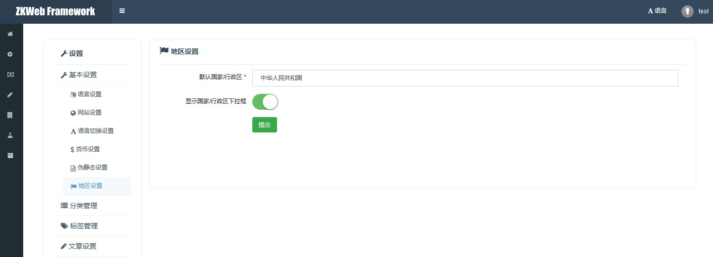
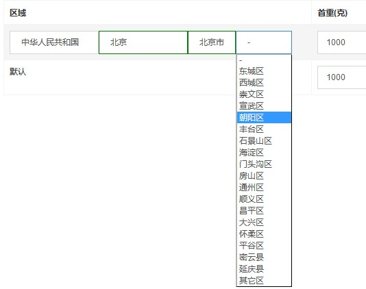

地区插件提供了地区管理和选择地区使用的表单控件。<br/>
地区插件默认带了多个国家下的地区列表，地区列表使用json保存，也可以自己扩展修改。<br/>

### 地区设置



### 在表单中使用地区选择器



在表单中添加地区编辑器的字段<br/>
地区设置中可以全局控制是否显示国家下拉框，RegionEditor中可以单独控制。<br/>
不显示国家下拉框时，将显示绑定的国家或默认国家的地区列表。<br/>

``` csharp
[Required]
[RegionEditor("Region")]
public CountryAndRegion Region { get; set; }
```

提交后保存字段中的国家和地区Id<br/>

``` csharp
saveTo.Country = Region.Country;
saveTo.RegionId = Region.RegionId;
```

### 地区的操作

**根据名称获取国家**

``` csharp
var regionManager = Application.Ioc.Resolve<RegionManager>();
var country = regionManager.GetCountry("CN");
```

**获取默认国家**

``` csharp
var regionManager = Application.Ioc.Resolve<RegionManager>();
var country = regionManager.GetDefaultCountry();
```

**获取地区列表**

``` csharp
var regionManager = Application.Ioc.Resolve<RegionManager>();
var country = regionManager.GetDefaultCountry();
var regions = country.GetRegions();
```

**获取地区树**

``` csharp
var regionManager = Application.Ioc.Resolve<RegionManager>();
var country = regionManager.GetDefaultCountry();
var tree = country.GetRegionsTree();
```

**根据地区Id获取地区节点**

``` csharp
var regionManager = Application.Ioc.Resolve<RegionManager>();
var country = regionManager.GetDefaultCountry();
var node = country.GetRegionsTreeNode(regionId);
```
