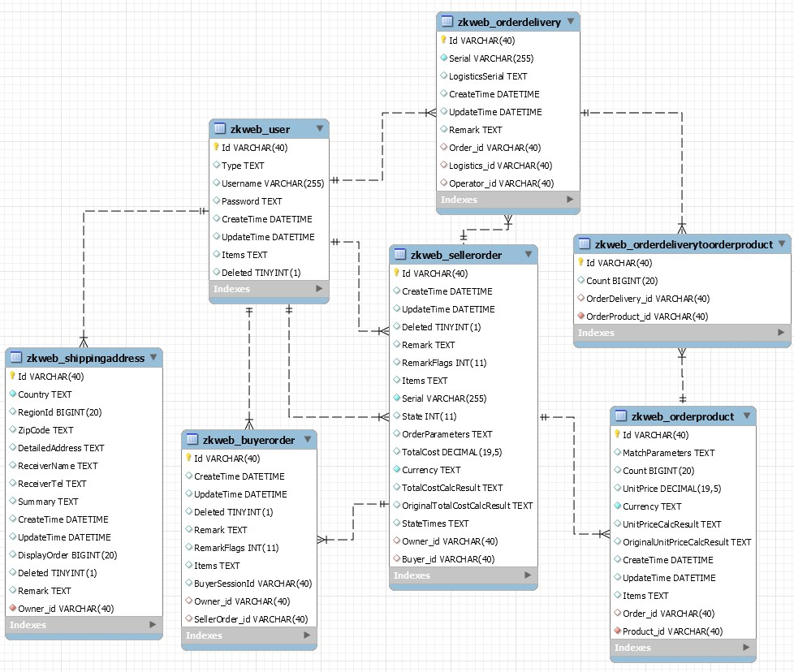

订单插件提供了购买商品相关功能，包括 

- 购物车
- 订单支付
- 订单管理
- 发货管理
- 收货地址管理

### 购物车的数据结构

购物车商品可以关联用户，也可以关联会话，如果开启了非会员下单，则不需要登陆也可以添加商品到购物车。 

TODO: 更新这张图

### 订单的数据结构

一个订单对应多个订单商品，订单商品保存了下单时的商品价格等信息。 
订单可以关联买家和卖家，但不能关联多个卖家，如果购物车中有多个卖家的商品时会分别下单。 

TODO: 更新这张图

### 发货单的数据结构

一个订单可以分多次发货，发货单关联了订单商品和发货数量。 
如果发货商品中包含了实体商品，应该选择物流和填写物流编号。 
订单和发货单会把用户填写的收货地址复制一份保存在内部，不会关联收货地址表中的数据。 

### 购物车页面

### 前台订单页面

TODO

### 后台订单页面

TODO

### 订单数据的详细解释

每个订单都会分一个买家订单和卖家订单，买家订单属于买家，卖家订单属于卖家。 
订单的数据主要在卖家订单中，交易关联的也是卖家订单。 

- BuyerOrder 买家订单
	- SellerOrder 对应的卖家订单
	- BuyerSessionId 买家的会话Id，仅用于非会员下单
	- Owner 买家用户，没有时等于null
	- CreateTime 创建时间
	- UpdateTime 更新时间
	- Deleted 是否已删除
	- Remark 买家备注
- SellerOrder 卖家订单
	- Serial 订单编号，唯一键
	- Buyer 买家用户，没有时等于null
	- Owner 卖家用户，没有时等于null
	- State 订单状态，一个枚举值
	- OrderParameters 订单参数，类型是Dictionary<string, object>
		- ShippingAddress 收货地址，格式是{ Country: 国家Id, RegionId: 地区Id, ... }
		- SellerToLogistics 卖家分别选择的物流，格式是{ SellerId: LogisticsId, ... }
		- PaymentApiId 支付接口Id
		- CartProducts 商品列表，格式是{ 购物车商品Id: 数量, ... }
		- 支持更多的参数
	- TotalCost 当前的订单总金额
	- Currency 货币单位
	- TotalCostCalcResult 当前的订单总金额的计算结果，类型是OrderPriceCalcResult
	- OriginalTotalCostCalcResult 原始的订单总金额的计算结果，类型同上，创建订单时的价格
	- CreateTime 创建时间
	- UpdateTime 更新时间
	- StateTimes 各个状态的切换时间
	- Deleted 是否已删除
	- Remark 卖家备注
	- OrderProducts 订单商品的集合，一对多
		- Product 对应的商品，多对一
		- MatchParameters 商品匹配参数，包含规格等信息
		- Count 购买数量
		- UnitPrice 单价
		- Currency 单价的货币
		- UnitPriceCalcResult 单价的计算结果，类型是OrderPriceCalcResult
		- OriginalUnitPriceCalcResult 原始单价的计算结果，类型同上，创建订单时的价格
		- CreateTime 创建时间
		- LastUpdated 更新时间
		- PropertyValues 关联的属性值集合，多对多，类型是OrderProductToPropertyValue
	- OrderComments 订单留言的集合，一对多
		- Creator 留言人
		- Side 买家或卖家留言，枚举类型
		- Content 留言内容
		- CreateTime 创建时间
  
- OrderDelivery 发货单
	- Serial 发货单编号，唯一键
	- Order 属于的订单，多对一
	- Logistics 物流，多对一
	- LogisticsSerial 物流给出的发货编号（快递单编号），虚拟发货时不需要
	- Operator 发货人
	- CreateTime 创建时间
	- LastUpdated 更新时间
	- Remark 备注
	- OrderProducts 包含的商品集合，一对多，类型是ISet<OrderDeliveryToOrderProduct>
		- OrderProduct 订单商品，多对一
		- Count 发货件数

### 完整的订单流程

- 买家添加商品到购物车
- 买家跳转到购物车页面
- 买家提交订单
	- 提交商品和数量，收货地址，物流和支付接口等信息
	- 如果提交了包含多个卖家的商品，应该每个卖家创建一个单独的订单
	- 运费每个卖家分别计算
- 买家跳转到结算页面
	- 结算页面会显示金额和跳转到支付平台的按钮
- 卖家有需要时可以修改收货地址或金额
- 买家跳转到支付平台
- 买家在支付平台上完成付款
	- 即时到账或担保交易
- 卖家在后台进行发货操作
	- 可以分几次发货完毕
- 买家确认收货，确认后订单交易完成
	- 可以在会员中心确认收货
	- 也可以在支付平台上确认收货

### FAQ

**买家可以对订单进行哪些操作？**

买家可以付款，取消订单和确认收货。

**卖家可以对订单进行哪些操作？**

卖家可以修改地址，修改价格和数量，发货和作废订单。

**取消订单和作废订单有什么区别？**

取消订单是买家操作的，作废订单是卖家或后台操作的， 
取消订单只能在付款前操作，作废订单可以在订单交易之前操作。 

**多卖家下单时是怎样处理的？**

多卖家下单时会根据每个卖家分别创建订单和交易，所有交易创建完成后会创建一笔合并交易。 
这个插件没有提供卖家发货的管理界面，只能在后台中发货，需要这个功能应该使用关联的其他插件。 

**合并支付订单是怎么处理的？**

如果下单时包含多个卖家的商品，会根据卖家创建多个订单和多个交易，并再创建一笔合并交易。 
如果不支付合并交易而是单独打开子交易进行支付，合并交易会自动作废。 
会员可以在会员中心手动创建新的合并交易，这时原有的合并交易也会自动作废。 

**各个操作的条件是什么**

- 买家取消订单: 买家付款之前
- 买家付款: 买家付款之前
- 买家确认收货: 卖家全部发货之后，订单交易成功之前
- 卖家修改地址: 卖家全部发货之前
- 卖家修改价格: 买家付款之前，和担保交易开始付款之前
- 卖家发货: 卖家全部发货之前
- 卖家作废订单: 订单交易成功之前
- 卖家代确认收货: 卖家全部发货之后，订单交易成功之前
