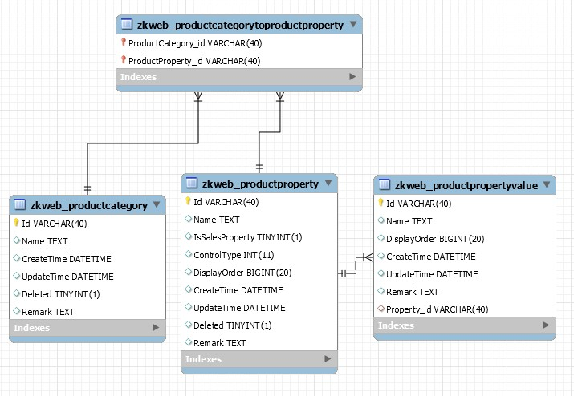
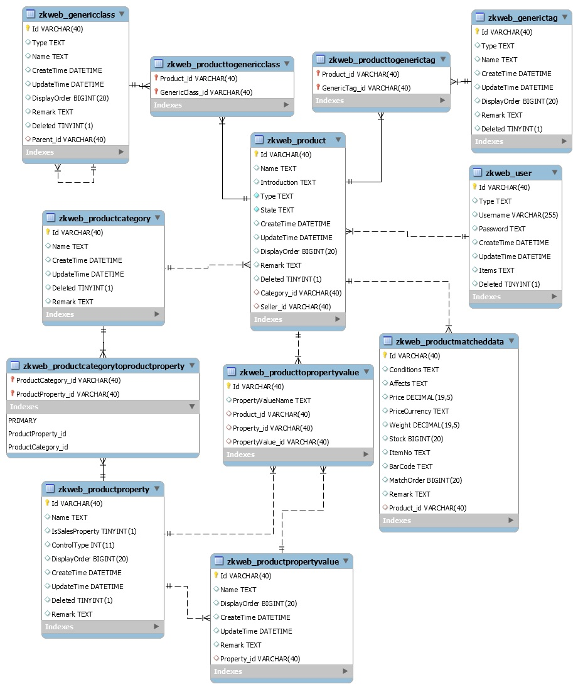
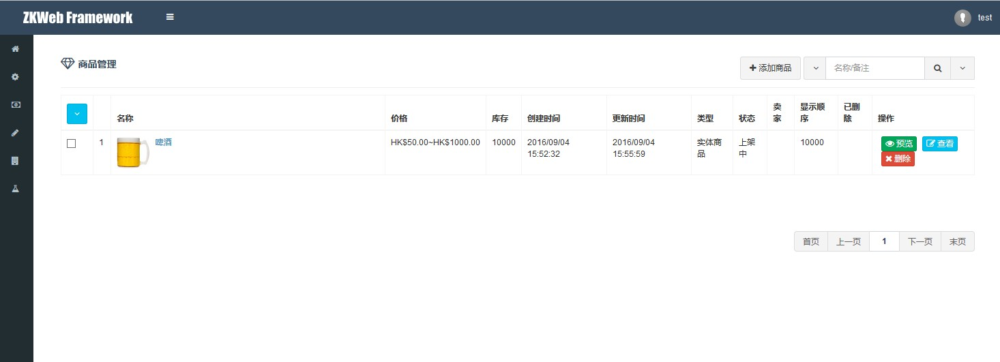
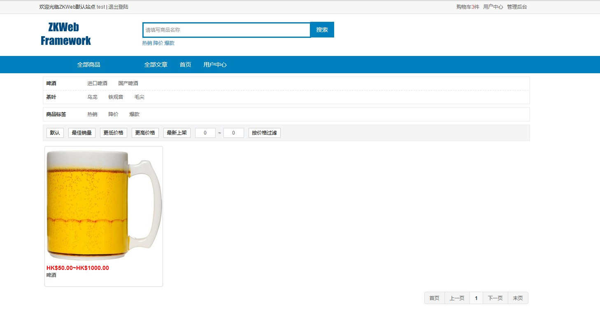
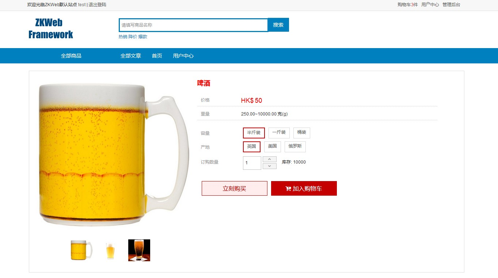

商品插件提供了商城使用的商品管理和展示功能。 
商品插件仅实现了最基本的商品功能，但提供了灵活的接口，可以在其他插件中实现更高级的功能。 

### 商品类目的数据结构

类目下有规格和属性， 
规格代表在购买时需要选择的值，例如颜色尺码套餐， 
属性代表只用于显示的值，例如年份品牌。 

### 商品的数据结构

商品可以关联多个分类和标签，商品可以选择一个类目并设置规格和属性。 
商品可以设置价格和库存的匹配规则，符合指定的条件时使用指定的价格和库存（可以把有填写库存的规则看成一个SKU）。 
商品可以设置对应的卖家，其他插件可以对有卖家的商品进行多店铺商城专用的特殊处理。 

### 商品的管理界面

### 商品的列表页面

### 商品的展示页面

### 商品数据的详细解释

- Product 商品
	- Category 商品类目，多对一，类目下包含了可以使用的规格和属性
		- Name 类目名称
		- Properties 类目包含的属性，多对多，例如"颜色"可以同时用在服装和自行车上
			- Name 属性名称
			- IsSalesProperty 是否销售属性，例如颜色和尺寸等是销售属性，年份和材质等是非销售属性
			- ControlType 编辑时用的控件类型，有文本框，下拉框和多选框等
			- PropertyValues 属性值列表，一对多
				- Name 属性值名称
				- DisplayOrder 显示顺序，从小到大
				- CreateTime 创建时间
				- LastUpdated 更新时间
				- Remark 备注
			- DisplayOrder 显示顺序，从小到大
			- CreateTime 创建时间
			- LastUpdated 更新时间
			- Deleted 是否已删除
			- Remark 备注
		- CreateTime 创建时间
		- LastUpdated 更新时间
		- Deleted 是否已删除
		- Remark 备注
	- Name 商品名称
	- Introduction 商品介绍，格式是Html
	- Type 商品类型，默认有实体商品和虚拟商品
	- State 商品状态，默认有已上架，等待上架和已下架
	- Seller 卖家，可以没有卖家
	- CreateTime 创建时间
	- UpdateTime 更新时间
	- DisplayOrder 显示顺序，前台展示时默认按这个顺序显示，从小到大
	- Remark 备注，格式是Html
	- Deleted 是否已删除
	- Classes 关联的商品分类
	- Tags 关联的商品标签
	- MatchedDatas 商品匹配数据，一对多
		- Conditions 匹配条件，类型是Dictionary<string, object>，包含规格和购买数量等
		- Affects 影响的数据，类型是是Dictionary<string, object>，包含价格和库存等
		- Price 价格，等于null时继续匹配下一项
		- PriceCurrency 价格的货币，跟随价格匹配
		- Weight 重量，等于null时继续匹配下一项
		- Stock 库存，等于null时继续匹配下一项
		- ItemNo 货号，等于null时继续匹配下一项
		- BarCode 条形码，等于null时继续匹配下一项
		- MatchOrder 匹配顺序，从小到大
		- Remark 备注，纯文本
	- PropertyValues 关联的属性值，一对多，选中的规格和属性的值
		- Property 属性，例如颜色
		- PropertyValue 属性值，例如黑色
		- PropertyValueName 属性值的别名

### FAQ

**商品类目和商品分类有什么区别？**

类目包含规格和属性，只有一层且不应该作为展示时的过滤条件， 
分类没有额外的数据，有多层且可以作为展示时的过滤条件。 
例如服装类目包含规格"尺寸,颜色"和属性"品牌,年份"， 
这个类目下的商品可以关联分类"上装,下装,鞋子"等。 

**商品的销售属性(规格)和非销售属性(属性)有什么区别？**

销售属性(规格)在购买商品时需要选择，并且可以参与匹配数据，例如颜色和尺寸等。 
非销售属性(属性)是固定的值，只能在编辑商品时设置一个，例如品牌和年份等。 

**为什么使用商品匹配数据储存价格和库存？**

传统储存商品价格会使用SKU，例如黑色大码是一个SKU，价格就和这个SKU绑定。 
但如果后面添加了套餐这个规格，以前的SKU就需要复制n份，这样会导致数据关联困难， 
同样的对于删除规格处理起来也比较麻烦。 
这个商品插件使用了匹配规则代替SKU表格，匹配规则可以按部分规格来决定价格，例如大码不管什么颜色都是一个价格。 
匹配规则还可以根据订购的数量来决定价格，如果数量超过指定的数量时可以使用一个更便宜的价格，但共用一个库存。 
匹配规则从上到下匹配，如果中途遇到空值则继续向下匹配，例子如下 

| 条件                     | 价格 | 库存  |
| ------------------------ |:----:|:-----:|
| 大码 黑色 订购数量>50     | 88   | 继承  |
| 大码 订购数量>50          | 89   | 继承  |
| 大码                     | 100  | 10000 |
| 默认                     | 101  | 20000 |

**商品类型和状态可以扩展吗？**

商品类型可以通过继承`IProductType`进行扩展。 
商品状态可以通过继承`IProductState`进行扩展。 
如果需要控制商品类型是否实体商品可以继承`IAmRealProduct`。 
如果需要控制商品状态是否允许显示在列表页可以修改特征`IAmVisibleToThePublic`。 
扩展商品类型可以实现一些高级功能，例如把商品分为团购商品和普通商品，再对团购商品进行特殊的处理。 

**商品属于卖家是怎样处理的？**

商品可以属于单个卖家，也可以属于系统。 
这个插件没有提供给卖家使用的管理界面，也没有提供卖家的店铺页面，需要这些功能应该使用关联的其他插件。 
商品属于卖家时会影响到创建订单的处理，详细请查看[订单插件](shopping.order)的文档。 
