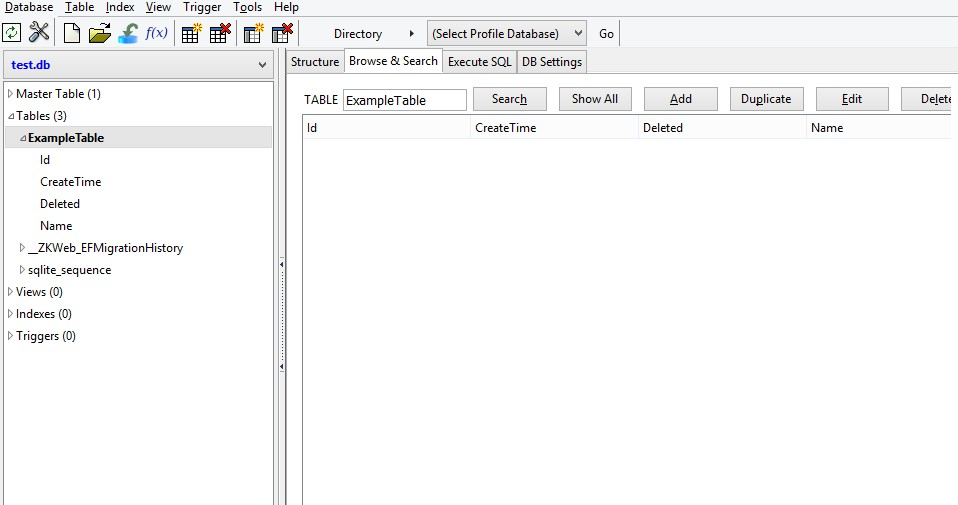

ZKWeb支持多ORM和多数据库。<br/>
支持的ORM有NHibernate, EFCore, Dapper, MongoDB。<br/>
支持的数据库有MSSQL, MySQL, SQLite, PostgreSQL, InMemory, MongoDB。<br/>
ORM提供了统一的接口，但因为支持的功能有差异同一份代码兼容多个ORM比较困难，最底部可以看到当前默认插件集的兼容情况。<br/>

### 添加数据实体

添加`src\Domain\Entities\ExampleTable.cs`，内容如下
``` csharp
[ExportMany]
public class ExampleTable : IEntity<long>, IEntityMappingProvider<ExampleTable> {
	public virtual long Id { get; set; }
	public virtual string Name { get; set; }
	public virtual DateTime CreateTime { get; set; }

	public virtual void Configure(IEntityMappingBuilder<ExampleTable> builder) {
		builder.Id(e => e.Id);
		builder.Map(e => e.Name);
		builder.Map(e => e.CreateTime);
	}
}
```

数据实体需要继承`IEntity<T>`，并且还需要注册`IEntityMappingProvider<TEntity>`到容器。<br/>
ZKWeb支持定义一对多(Reference, HasMany)，多对多(ManyToMany)等关系。<br/>

### 升级数据表

NHibernate支持自动更新数据表结构，直接修改代码并刷新浏览器即可。<br/>
EFCore支持自动更新数据表结构，也是修改后刷新浏览器即可，但注意重命名字段有可能导致数据丢失。<br/>
MongoDB不需要更新数据表结构，也是修改后刷新浏览器即可。<br/>
Dapper不支持自动更新数据表结构，需要手动同时修改数据库，也可以借助NHibernate或者EFCore进行迁移。<br/>

在ExampleTable中添加以下成员<br/>
``` csharp
public virtual bool Deleted { get; set; }
```

在`Configure`函数中添加以下行<br/>
``` csharp
builder.Map(e => e.Deleted);
```

保存后刷新浏览器即可看到效果。<br/>


### 增删查改

通过`DatabaseManager.CreateContext`获取数据库上下文可以进行增删查改等操作。s<br/>
数据库上下文默认不开启事务，需要时可以调用`BeginTransaction`和`FinishTransaction`，这两个函数支持嵌套使用。<br/>

**新增数据的例子**<br/>
``` csharp
[Action("example/add_data")]
public string AddData() {
	var databaseManager = Application.Ioc.Resolve<DatabaseManager>();
	using (var context = databaseManager.CreateContext()) {
		var data = new ExampleTable() {
			Name = "test",
			CreateTime = DateTime.UtcNow,
			Deleted = false
		};
		context.Save(ref data);
	}
	return "success";
}
```

**修改数据的例子**<br/>
这里会修改表中的所有数据。<br/>
和新增数据一样，修改数据也会使用`Save`函数，但是修改操作应该在`action`参数中实现，<br/>
这样使用数据库事件可以捕捉到修改前和修改后的数据。<br/>
``` csharp
[Action("example/update_data")]
public string UpdateData() {
	var databaseManager = Application.Ioc.Resolve<DatabaseManager>();
	using (var context = databaseManager.CreateContext()) {
		foreach (var data in context.Query<ExampleTable>()) {
			var localData = data;
			context.Save(ref localData, d => d.Name = "updated");
		}
	}
	return "success";
}
```

**查询数据的例子**<br/>
这里返回没有更新的数据内容。<br/>
``` csharp
[Action("example/query_data")]
public string QueryData() {
	var databaseManager = Application.Ioc.Resolve<DatabaseManager>();
	using (var context = databaseManager.CreateContext()) {
		var notUpdated = context.Query<ExampleTable>()
			.Where(t => t.Name != "updated").ToList();
		return string.Format("these objects are not updated:\r\n{0}",
			JsonConvert.SerializeObject(notUpdated, Formatting.Indented));
	}
}
```

**删除数据的例子**<br/>
``` csharp
[Action("example/remove_data")]
public string RemoveData() {
	var databaseManager = Application.Ioc.Resolve<DatabaseManager>();
	using (var context = databaseManager.CreateContext()) {
		long deleted = context.BatchDelete<ExampleTable>(d => d.Name == "updated");
		return string.Format("{0} objects are removed", deleted);
	}
}
```

### 实体事件

ZKWeb支持定义事件监听实体的增删查改，继承`IEntityOperationHandler<TEntity>`并注册到容器即可。<br/>
在Before函数中抛出例外可以阻止操作，如果使用了事务，在After函数中抛出例外也可以阻止操作。<br/>

**实体事件的示例**<br/>
添加`src\EntityOperationHandlers\ExampleEntityOperationHandler.cs`，内容如下<br/>
添加或更新或删除数据后可以查看`ZKWeb\App_Data\Logs`下的日志是否记录成功。<br/>
``` csharp
[ExportMany]
public class ExampleEntityOperationHandler : IEntityOperationHandler<ExampleTable> {
	private long IdBeforeSave { get; set; }
	private string NameBeforeSave { get; set; }

	public void BeforeSave(IDatabaseContext context, ExampleTable data) {
		IdBeforeSave = data.Id;
		NameBeforeSave = data.Name;
	}

	public void AfterSave(IDatabaseContext context, ExampleTable data) {
		var logManager = Application.Ioc.Resolve<LogManager>();
		if (IdBeforeSave <= 0) {
			logManager.LogDebug(string.Format("example data inserted, id is {0}", data.Id));
		} else if (NameBeforeSave != data.Name) {
			logManager.LogDebug(string.Format("example data name changed, id is {0}", data.Id));
		}
	}

	public void BeforeDelete(IDatabaseContext context, ExampleTable data) {
	}

	public void AfterDelete(IDatabaseContext context, ExampleTable data) {
		var logManager = Application.Ioc.Resolve<LogManager>();
		logManager.LogDebug(string.Format("example data deleted, id is {0}", data.Id));
	}
}
```

### 批量操作

批量操作可以带来更好的性能，ZKWeb提供了以下批量操作的函数

- BatchSave 批量保存
- BatchUpdate 批量更新
- BatchDelete 批量删除
- FastBatchSave 更快的批量保存，不会触发数据事件
- FastBatchDelete 更快的批量删除，不会触发数据事件

### 原生查询

如果上面的函数仍不满足性能要求时，可以使用原生查询。<br/>
各个ORM的原生查询格式都不一样，这里以Dapper为例。<br/>

执行储存过程（添加、更新或删除）
``` csharp
long affected = context.RawUpdate("exec some_update_sp @arg", new { arg = 1 });
```

执行储存过程（查询）
``` csharp
var result = context.RawQuery<ExampleTable>("exec some_query_sp @arg", new { arg = 1 }).ToList();
```

### 局部指定表名

使用`builder.TableName`可以指定当前实体的表名, 代码如下<br/>

``` csharp
[ExportMany]
public class ExampleTable : IEntity<long>, IEntityMappingProvider<ExampleTable> {
	public virtual long Id { get; set; }
	public virtual string Name { get; set; }
	public virtual DateTime CreateTime { get; set; }

	public virtual void Configure(IEntityMappingBuilder<ExampleTable> builder) {
		builder.TableName("myExampleTable");
		builder.Id(e => e.Id);
		builder.Map(e => e.Name);
		builder.Map(e => e.CreateTime);
	}
}
```

### 全局处理表名

ZKWeb允许全局处理表名，继承`IDatabaseInitializeHandler`并注册到容器即可。<br/>
注意这里更改了表名以后，原来创建的数据都不会自动迁移过去，有需要请手动进行迁移。<br/>
示例代码<br/>
```
[ExportMany]
public class DatabaseInitializeHandler : IDatabaseInitializeHandler {
	public void ConvertTableName(ref string tableName) {
		tableName = "ZKWeb_" + tableName;
	}
}
```

全局处理表名和局部指定表名可以同时使用, 上面的例子中`Example`实体的表名会变为`ZKWeb_myExampleTable`

### 禁用自动升级数据表

部分情况下你可能想禁用NHibernate或者EFCore组件提供的数据库自动迁移功能, 禁用这项功能可以修改`App_Data\config.json`下的选项, 例如

``` json
{
	"ORM": "EFCore",
	"Database": "SQLite",
	"ConnectionString": "Data Source={{App_Data}}/test.db;",
	"PluginDirectories": [ "App_Data" ],
	"Plugins": [],
	"Extra": {
		"ZKWeb.DisableEFCoreDatabaseAutoMigration": true,
		"ZKWeb.DisableNHibernateDatabaseAutoMigration": true
	}
}
```

### 已知问题

- EFCore目前还不支持定义多对多的关系，可以手动创建一个中间表支持
- EFCore目前还不支持懒加载，嵌入关联表时需要引入EF依赖并使用Include函数
- Asp.Net和Owin上使用Microsoft.Data.Sqlite需要手动进`bin\x86`文件夹复制dll到`bin`下，这是因为微软的Sqlite包不支持旧的项目

### 默认插件集的兼容性

- Common.Base: NHibernate, MongoDB, Dapper, InMemory
- Common.Captcha: NHibernate, MongoDB, Dapper, InMemory
- Common.Admin: NHibernate, MongoDB, Dapper, InMemory
- 其他: 仅NHibernate

EFCore因为功能上的问题目前不兼容任何官方的插件，但是可以开发自己的插件集
