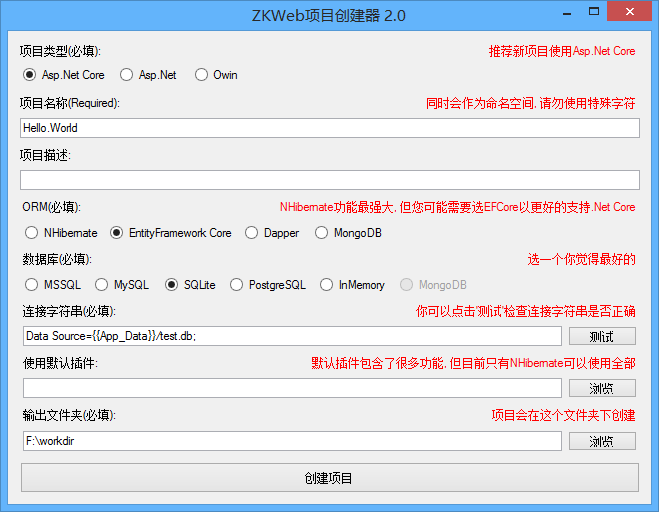
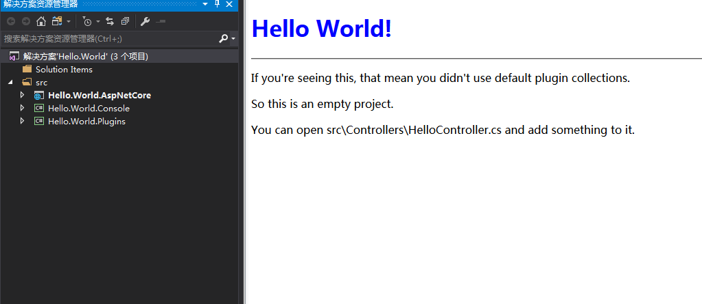

如果您想从头熟悉ZKWeb, 或者不想使用预先写好的插件, 可以创建一个空白项目.<br/>

空白项目只包含一个控制器和一个静态资源的处理器.

### 下载ZKWeb

首先打开[ZKWeb的项目地址](https://github.com/zkweb-framework/zkweb), 然后点击下图的按钮下载到本地.


### 使用项目创建器创建项目

打开'ZKWeb\Tools\ProjectCreator.Gui.Windows\ZKWeb.Toolkits.ProjectCreator.Gui.exe',<br/>
可以看到下面的界面.



推荐选择 Asp.Net Core + EntityFramework Core + SQLite, 这样创建好项目马上就可以打开.

再选择输出文件夹后点击"创建项目"即可.

### 运行项目

打开项目运行后可以看到以下的界面:



### 空白项目的结构

打开项目以后我们可以看到里面有"AspNetCore", "Console", "Plugins"三个项目,

"AspNetCore"项目仅用于启动网站, 里面不会放任何业务代码,

"Console"项目用于运单元和集成测试, 或运行一些临时的代码片段,

"Plugins"项目用于保存插件, 下面一个文件夹代表一个插件, 业务处理都会写到这个项目下面.

### 空白项目包含的控制器

空白项目包含了一个"HelloController",<br/>
这个控制器是在"Plugin"中手动注册的, 注册的前提是当前未引用名字叫"Common.Base"的插件.

另外还包含一个"HelloStaticHandler",<br/>
这个处理器用于返回静态文件的内容, 注册的前提跟上面一样.

这两个组件都是手动注册的,<br/>
如果您想让它们自动注册可以删掉"Plugin"中的内容, 并在这两个class上标记"[ExportMany]".

例如

``` csharp
[ExportMany]
public class HelloController : IController { /* 原有的内容 */ }
```

当您想添加其他控制器的时候也可以这样添加, 只需要在上面标记"[ExportMany]"就可以自动注册.

### 了解更多

如果您已经成功创建和运行了空白项目, 您可以继续:

- [了解网站结构](website_struct/index.html)
- [创建更多的控制器](controller/index.html)
- [编写网页模板](template_engine/index.html)

更多的内容可以查看左边的"核心文档".
