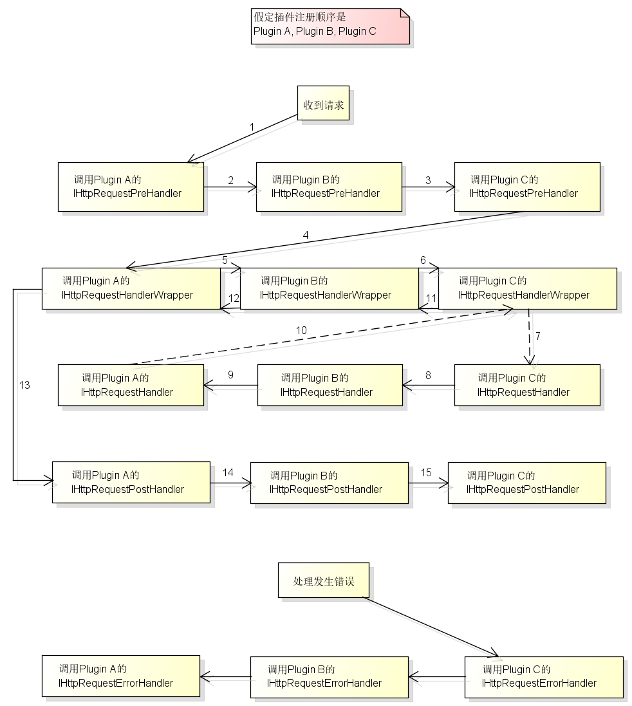

在ZKWeb中处理Http请求会使用Http请求处理器(`IHttpRequestHandler`),<br/>
上一篇介绍的控制器只是其中的一个处理器.<br/>
自己实现处理器可以处理更复杂的url, 例如返回静态文件等.

### Http请求的整体流程图



流程的伪代码请看最下面.

### Http请求处理器

这是`IHttpRequestHandler`的一个简单的例子,<br/>
访问`/example/handler/xxx`的时候会返回`the path is xxx`.

``` csharp
[ExportMany]
public class HttpRequestHandlerExample : IHttpRequestHandler {
	public const string Prefix = "/example/handler/";
	public void OnRequest() {
		var request = HttpManager.CurrentContext.Request;
		var response = HttpManager.CurrentContext.Response;
		if (request.Path.StartsWith(Prefix)) {
			new PlainResult("the path is " + request.Path.Substring(Prefix.Length))
				.WriteResponse(response);
			response.End();
		}
	}
}
```

需要注意的是, 请求处理器会按注册顺序的相反顺序调用,<br/>
越后面注册的处理器调用的越前,<br/>
如果前面的处理器调用了`response.End()`, 就不会再调用后面的处理器了.<br/>

### Http请求预处理器

有的情况下, 您可能想给所有Http请求添加一个自定义的Header,<br/>
但是如果使用`IHttpRequestHandler`, 又很难保证注册的处理器是最后注册的.<br/>
ZKWeb针对这种情况提供了另外一个接口`IHttpRequestPreHandler`.<br/>

``` csharp
[ExportMany]
public class AddVersionHeaderHandler : IHttpRequestPreHandler {
	public void OnRequest() {
		var response = HttpManager.CurrentContext.Response;
		response.AddHeader("X-ZKWeb-Version", Application.FullVersion);
	}
}
```

`IHttpRequestPreHandler`可以保证在所有`IHttpRequestHandler`前调用,<br/>
注意`IHttpRequestPreHandler`中不应该写入`Response`和调用`response.End()`.<br/>

### Http请求的后处理器

同样的, 如果您想在所有Http请求处理后执行一些自定义的操作,<br/>
可以使用`IHttpRequestPostHandler`接口, 这个接口的使用跟上面一样,<br/>
只是它会保证在所有`IHttpRequestHandler`之后执行.<br/>

### Http请求包装器

有时候您可能会想同时使用预处理器和后处理器, 也就是想把请求嵌套在`using`里面,<br/>
同时使用上面的`IHttpRequestPreHandler`和`IHttpRequestPostHandler`可能比较困难.<br/>
这时候可以使用`IHttpRequestHandlerWrapper`.<br/>

这个接口的使用跟Owin, Asp.Net Core的中间件比较相似.<br/>

``` csharp
[ExportMany]
public class ExampleWrapper : IHttpRequestHandlerWrapper {
	public Action WrapHandlerAction(Action action) {
		return () => {
			using (SomeScope()) {
				action();
			}
		};
	}
}
```

如果您只考虑控制器, 也可以使用前一篇提到的`Action过滤器`.<br/>

### Http错误处理器

ZKWeb提供了一个专门的错误处理器,<br/>
注册`IHttpRequestErrorHandler`接口即可全局处理请求中的错误.<br/>

``` csharp
[ExportMany]
public class HttpErrorHandlerExample : IHttpRequestErrorHandler {
	public void OnError(Exception ex) {
		var httpEx = ex as HttpException; // HttpException in ZKWebStandard.Web
		if (httpEx != null && httpEx.StatusCode == 404) {
			var response = HttpManager.CurrentContext.Response;
			new PlainResult("custom 404 page").WriteResponse(response);
			response.End();
		}
	}
}
```

如果有多个错误处理器, 会按注册顺序的相反顺序调用,<br/>
如果其中一个调用了`response.End()`则不继续调用.<br/>

### Http请求的整体流程

上面的处理器的整体调用流程是:

``` text
try {
	try {
		按注册顺序枚举IHttpRequestPreHandler {
			调用OnRequest函数
		}
		处理函数 = new Action ({
			按注册顺序的相反顺序枚举IHttpRequestHandler {
				调用OnRequest函数 <= 控制器会在这里调用
			}
			抛出404错误
		})
		按注册顺序枚举IHttpRequestHandlerWrapper {
			处理函数 = wrapper.WrapHandlerAction(处理函数)
		}
		调用处理函数
	} finally {
		按注册顺序枚举IHttpRequestPostHandler {
			调用OnRequest函数
		}
	}
} catch (代表请求结束的例外) {
	处理请求完成
} catch (Exception ex) {
	try {
		按注册顺序的相反顺序枚举IHttpRequestErrorHandler {
			调用OnError函数
		}
	} catch (代表请求结束的例外) {
		处理错误完成
	}
}
```

ZKWeb默认注册的`IHttpRequestHandler`就是`ControllerManager`,<br/>
而默认注册的`IHttpRequestErrorHandler`则会记录错误日志到`App_Data\logs`下.
