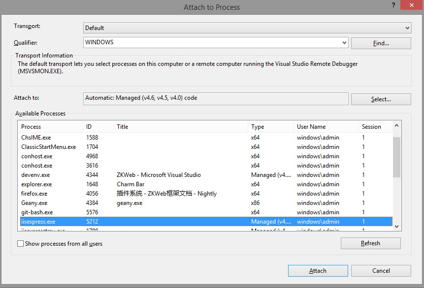

ZKWeb实现了一个非常灵活和强大的插件系统,<br/>
支持在任何位置存放插件, 在代码修改后自动编译, 以及发布时可以只发布程序集等等.<br/>
ZKWeb对插件的管理不依赖于IDE, 内部会调用Roslyn的API来完成对插件源代码的编译.<br/>

### 插件的查找和加载

在前面的[配置文件](website_config/index.html)已经提到过, 插件列表保存在`App_Data\config.json`下.


加载时会按`Plugins`中定义的顺序进行加载, 然后按`PluginDirectories`中定义的顺序进行查找.<br/>
以上面的配置为例, 假定网站项目在`D:\Projects\Hello.World\src\Hello.World.AspNetCore`,<br/>
会查找以下的路径加载`Common.Base`这个插件:<br/>

``` text
D:\Projects\ZKWeb.Plugins\Common.Base
D:\Projects\Hello.World\src\Hello.World.Plugins\Common.Base
```

加载完`Common.Base`后会按查找以下的路径加载`Common.Captcha`:

``` text
D:\Projects\ZKWeb.Plugins\Common.Captcha
D:\Projects\Hello.World\src\Hello.World.Plugins\Common.Captcha
```

一直到`Plugins`中的插件全部加载完毕.

### 插件信息

各个插件都会有文件和版本等信息, 这些信息保存在插件文件夹下的`plugin.json`中, 格式如下:<br/>

``` json
{
	"Name": "插件名称",
	"Version":  "插件版本",
	"Description": "插件描述",
	"Dependencies": [ "依赖的其他插件" ],
	"References": [ "依赖的程序集" ]
}
```

以下是`Common.Admin`插件的`plugin.json`:

``` json
{
	"Name": "Admin Panel",
	"Version": "1.8.0",
	"Description": "Admin panel and users management",
	"Dependencies": [ "Common.Base", "Commin.Captcha" ]
}
```

添加新的插件时仿照这个格式编写`plugin.json`即可.

### 插件的目录结构

插件的目录结构在[网站结构](website_struct/index.html)中已经提过, 如下:<br/>

- 插件名称
	- bin 由插件编译出来的程序集
	- src 插件的源代码
		- Controllers 储存控制器的文件夹
		- 更多保存代码的文件夹...
		- Plugin.cs 载入插件时的处理, 可以省略
	- static 静态文件
	- templates 模板文件
	- templates.mobile 移动端专用的模板文件
	- plugin.json 插件信息

[使用发布工具发布网站](publish_project/index.html)后会自动删除src目录, 所以最终发布出来的插件不会包含源代码.

### 依赖的程序集

插件需要依赖外部的程序集时， 需要在`plugin.json`的`References`指定.

以`Common.QRCoder`为例

- Common.QRCoder 插件文件夹
	- references
		- net
			- QRCoder.dll net461版本的程序集
		- netstandard
			- QRCoder.dll netstandard版本的程序集
	- plugin.json

`plugin.json`的内容如下

``` json
{
	"Name": "QRCoder",
	"Version": "1.8.0",
	"Description": "Support generate QRCode",
	"References": [ "QRCoder" ],
	"Dependencies": [ "Common.Base" ]
}
```

ZKWeb在读取到`References`后会自动从`references`文件夹下查找对应的程序集并载入.

### 透过式文件系统

ZKWeb使用了类似Django的透过式文件系统, 一个插件可以简单的重载另外一个插件的资源文件.<br/>
读取资源文件的顺序如下, 会返回最先存在的路径.<br/>

```
"App_Data/路径"
foreach (按加载顺序的相反顺序枚举插件) {
	"插件目录/路径"
}
```

例如插件加载顺序是 `Plugins: [ "PluginA", "PluginB" ]`, 且目录结构如下:


读取资源`templates/some_folder/some.html`会读取`PluginB`下的文件,<br/>
读取资源`static/other_folder/other.txt`会读取`PluginA`下的文件.<br/>

读取资源文件可以使用以下的代码

``` csharp
var fileStorage = Application.Ioc.Resolve<IFileStorage>();
var file = fileStorage.GetResourceFile("templates", "some_folder", "some.html");
var contents = file.ReadAllText();
```

### 组件的注册顺序

在ZKWeb中, 插件的注册顺序会影响组件的注册顺序.<br/>

例如插件加载顺序是 `Plugins: [ "PluginA", "PluginB" ]`,<br/>
插件`PluginA`有`[ExportMany]class ExampleHandlerA : IExampleHandler { }`,<br/>
插件`PluginB`有`[ExportMany]class ExampleHandlerB : IExampleHandler { }`.<br/>

这时使用`Application.Ioc.ResolveMany<IExampleHandler>()`会获取到包含两个实例的列表,<br/>
第一个实例类型是ExampleHandlerA, 第二个实例类型是ExampleHandlerB.

### 在网站启动时执行操作

部分插件可能需要在网站启动时执行一些操作, 可以使用`IPlugin`接口:

``` csharp
[ExportMany]
public Plugin : IPlugin {
	public Plugin() {
		// 这里会在网站启动时运行
		// 并且会按插件的注册顺序运行
	}
}
```

### 调试插件

调试在当前项目内的插件很简单, 直接F5运行并下断点即可.<br/>

调试在当前项目外的插件有两种办法:

- 第一种
	- 在插件的VS中选择`调试-挂载到进程`并选择IIS进程或Kestrel进程挂载
	- Asp.Net, Owin选择`iisexpress.exe`
	- Asp.Net Core选择`项目主程序.exe`, 注意不要选`iis`或者`w3wp`
- 第二种
	- 把需要调试的文件拖动到Visual Studio中，然后在里面下断点


