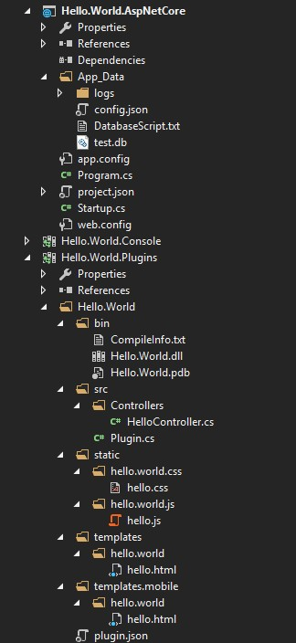

使用项目创建器创建的程序都会包含三个项目, 分别是

`项目名称.AspNetCore, AspNet或Owin`项目: 仅用于启动网站, 里面不会放任何业务代码.

`项目名称.Console`项目: 用于运行单元和集成测试, 或运行一些临时的代码片段.

`项目名称.Plugins`项目: 用于保存插件, 一个文件夹代表一个插件, 业务处理都会写到这个项目下面.

我们来看看这些项目都包含了什么文件

### 项目的文件结构

- Hello.World.AspNetCore 启动网站的项目
	- App_Data 数据文件, 这里面的文件不应该在更新时覆盖
		- logs 日志文件夹
		- config.json 网站的配置文件
		- DatabaseScript.txt 用于检测数据库是否需要更新的文件
		- test.db 数据库文件, 使用SQLite时才有
	- bin 程序文件, 用于运行网站
	- web.config IIS中使用的网站配置文件
- Hello.World.Console 帮助性的项目, 实际不属于网站
- Hello.World.Plugins 插件项目
	- Hello.World 一个插件文件夹
		- bin 由插件编译出来的程序集
		- src 插件的源代码
			- Controllers 储存控制器的文件夹
				- HelloController.cs 示例控制器
			- Plugin.cs 载入插件时的处理, 可以省略
		- static 静态文件
		- templates 模板文件
		- templates.mobile 移动端专用的模板文件
		- plugin.json 插件信息

### 插件列表的配置

一个网站可以有多个插件, 一个插件的源代码, 程序集和资源文件都会放在该插件所属的目录下.

`App_Data\config.json`中定义了查找插件使用的目录列表和插件列表. 

`Plugins`保存的是插件的**文件夹名称**.

`PluginDirectories`是查找插件文件夹使用的目录列表.

例如上面的配置会查找`../Hello.World.Plugins/Common.Base`是否存在, 
如果不存在则继续查找`../../../ZKWeb.Plugins/Common.Base`是否存在, 
如果存在则加载里面的内容.

对于各个插件的资源文件(`static`, `templates`等), 
ZKWeb使用了类似Django的透过式文件系统, 
详细可以查看[插件系统](plugin/index.html)中的说明.
