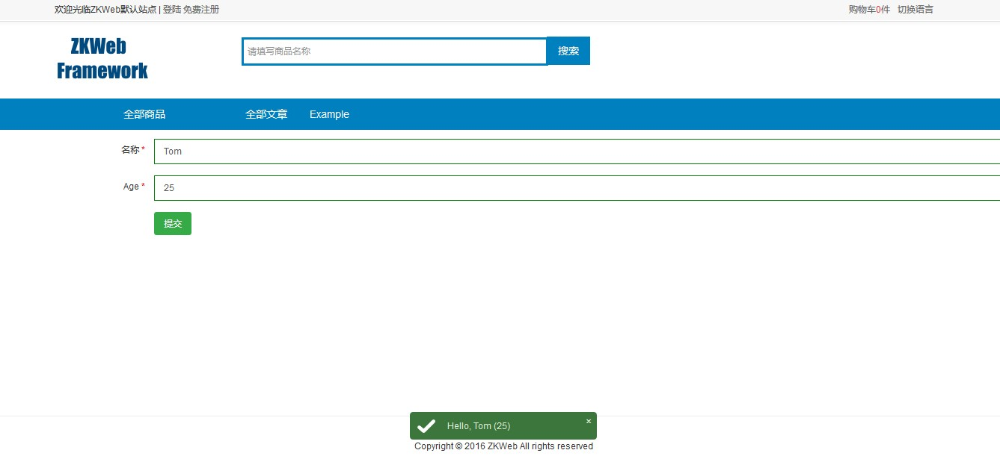

表单构建器可以构建常用的表单, 并支持多种表单字段和客户端+服务端验证.<br/>
默认构建的表单都会带CSRF校验值, 防止跨站攻击.<br/>

### 表单构建器的种类

基础插件中提供了多个种类的表单构建器, 可以按需要使用.<br/>

- `FormBuilder`
	- 最原始的表单构建器, 需要把字段一个个添加到`FormBuilder.Fields`
	- 绑定使用`BindValues`或`BindValuesFromAnonymousObject`
	- 提交使用`ParseValues`
- `ModelFormBuilder`
	- 支持从类型和成员的属性构建表单
	- 绑定使用`Bind`, 类型同时需要提供`OnBind`函数
	- 提交使用`Submit`, 类型同时需要提供`OnSubmit`函数
- `EntityFormBuilder`
	- 基于`ModelFormBuilder`, 可以根据url请求中的id函数获取和保存对象
	- 注意这个构建器自身不会进行权限的检查, 使用前需要自己检查或通过过滤器检查
	- 绑定使用`Bind`, 类型同时需要提供`OnBind`函数
	- 提交使用`Submit`, 类型同时需要提供`OnSubmit`函数
- `TabFormBuilder`
	- `FormBuilder`的多标签版本, 根据字段属性的`Group`划分标签
- `TabModelFormBuilder`
	- `ModelFormBuilder`的多标签版本, 根据字段属性的`Group`划分标签
- `TabEntityFormBuilder`
	- `EntityFormBuilder`的多标签版本, 根据字段属性的`Group`划分标签
- `FieldsOnlyFormBuilder`
	- 只描画字段, 不提供绑定和提交功能的构建器, 可以用于嵌入字段到现有的表单
- `FieldsOnlyModelFormBuilder`
	- 同`FieldsOnlyFormBuilder`, 支持从类型和成员的属性构建

### 使用表单构建器的例子

这里的例子使用了`ModelFormBuilder`.<br/>
**添加控制器**<br/>
添加`src\Controllers\FormExampleController.cs`<br/>
``` csharp
[ExportMany]
public class FormExampleController : ControllerBase {
	[Action("example/form")]
	[Action("example/form", HttpMethods.POST)]
	public IActionResult Form() {
		var form = new ExampleForm();
		if (Request.Method == HttpMethods.POST) {
			return new JsonResult(form.Submit());
		} else {
			form.Bind();
			return new TemplateResult("zkweb.examples/form.html", new { form });
		}
	}
}
```

**添加表单**<br/>
添加`src\UIComponents\Forms\ExampleForm.cs`<br/>
`Required`和`StringLength`属性需要引用`System.ComponentModel.DataAnnotations`程序集.<br/>
``` csharp
public class ExampleForm : ModelFormBuilder {
	[Required]
	[StringLength(100)]
	[TextBoxField("Name", "Please enter name")]
	public string Name { get; set; }
	[Required]
	[TextBoxField("Age", "Please enter age")]
	public int Age { get; set; }

	protected override void OnBind() {
		Name = "Tom";
		Age = 25;
	}

	protected override object OnSubmit() {
		var message = string.Format("Hello, {0} ({1})", Name, Age);
		return new { message };
	}
}
```

**添加模板文件**<br/>
添加`templates\zkweb.examples\form.html`<br/>
``` html



<div class="portlet">
	{{ form }}
</div>


```

效果<br/>


### 自定义提交地址等参数

表单构建器支持自定义提交地址等参数, 使用`ModelFormBuilder`时可以给表单类型添加`Form`属性.<br/>
``` csharp
[Form("ExampleForm", "/example/form", "POST", SubmitButtonText = "Submit this form")]
public class ExampleForm : ModelFormBuilder { }
```

### 提供的表单字段

基础插件提供了以下表单字段类型, <br/>
需要更多表单字段类型可以添加自定义的属性并注册`IFormFieldHandler`到容器.<br/>

- `LabelFieldAttribute(string name)`
	- 文本字段, 不可编辑
- `TextBoxFieldAttribute(string name, string placeHolder = null)`
	- 标准的文本框
- `PasswordFieldAttribute(string name, string placeHolder = null)`
	- 标准的密码框
- `TextAreaFieldAttribute(string name, int rows, string placeHolder = null)`
	- 标准的多行文本框
- `CheckBoxFieldAttribute(string name)`
	- 勾选按钮, 样式默认使用Switchery
- `CheckBoxGroupFieldAttribute(string name, Type source)`
	- 勾选按钮组, 会把选中按钮的值通过同一个字段提交, 格式是json
- `CheckBoxGroupsFieldAttribute(string name, Type source)`
	- 多个勾选按钮组, 会把选中按钮的值通过同一个字段提交, 格式是json
- `CheckBoxTreeFieldAttribute(string name, Type source)`
	- 勾选按钮树, 会把选中按钮的值通过同一个字段提交, 格式是json
- `DropdownListFieldAttribute(string name, Type source)`
	- 标准的下拉框
- `SearchableDropdownListFieldAttribute(string name, Type source)`
	- 可搜索的下拉框, 只支持搜索`select`下的值, 不支持远程搜索
- `RadioButtonsFieldAttribute(string name, Type sources)`
	- 单选按钮组
- `FileUploaderFieldAttribute(string name, string extensions = null, int maxContentsLength = 0)`
	- 文件上传控件, 要求字段是 IHttpPostedFile
	- 需要自己处理上传后的文件
- `FileUploaderAsUrlFieldAttribute(string name, string extensions = null, int maxContentsLength = 0)`
	- 文件上传控件, 要求字段是 string, 会存放上传后的文件Url
- `HiddenFieldAttribute(string name)`
	- 隐藏字段
- `JsonFieldAttribute(string name, Type fieldType)`
	- Json隐藏字段, 会自动序列化和反序列化
- `HtmlFieldAttribute(string name)`
	- 显示指定的Html的字段, 仅用于显示, 提交时无值
- `RichTextEditorAttribute(string name, string config)`
	- 富文本编辑器
	- 需要引用其他插件实现, 默认插件集中的[CMS.CKEditor](cms.ckeditor)实现了这个字段
