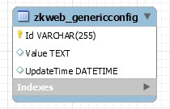

通用配置可以保存网站全局使用的参数, 例如网站名称和默认语言等.<br/>

### 通用配置的数据结构



### 添加配置类型

配置类型需要添加`GenericConfig`属性, <br/>
第一个参数是保存到数据库时使用的键名, `CacheTime`可以指定缓存时间（秒）.<br/>
缓存时间不会影响到网站部署到单个进程时的读取, 单个进程时读取配置总能读到最新的配置.<br/>
但会影响网站部署到多个进程或服务器时的读取, 缓存时间不应该指定太长.<br/>

**添加配置类型的例子**<br/>
添加`src\Components\GenericConfigs\ExampleConfig.cs`<br/>
``` csharp
[GenericConfig("ZKWeb.Example.ExampleConfig", CacheTime = 15)]
public class ExampleConfig {
	public string ExampleName { get; set; }
	public int ExampleCount { get; set; }
}
```

### 获取和保存配置

首次获取`ExampleConfig`时会返回一个新的实例, `GetData`函数不会返回null.<br/>

**获取和保存配置的例子**<br/>
添加`src\Controllers\ConfigExampleController.cs`<br/>
``` csharp
[ExportMany]
public class ConfigExampleController : ControllerBase {
	[Action("example/read_config")]
	public IActionResult ReadConfig() {
		var configManager = Application.Ioc.Resolve<GenericConfigManager>();
		var config = configManager.GetData<ExampleConfig>();
		return new JsonResult(config);
	}

	[Action("example/write_config")]
	public string WriteConfig() {
		var configManager = Application.Ioc.Resolve<GenericConfigManager>();
		var config = configManager.GetData<ExampleConfig>();
		config.ExampleName = "updated";
		config.ExampleCount++;
		configManager.PutData(config);
		return "success";
	}
}
```
