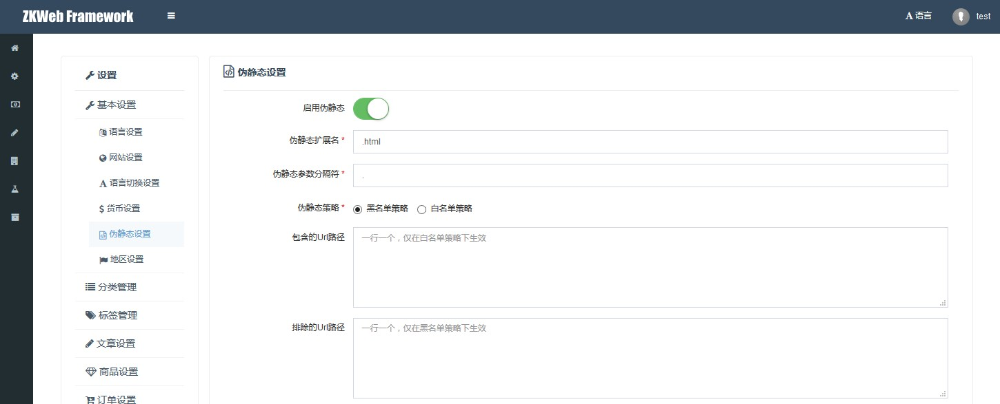

伪静态插件支持全局转换url到伪静态url的功能.<br/>
伪静态插件主要分两部分实现, 第一部分通过基础插件提供的全局url过滤器替换url, 第二部分在处理请求时解析替换的url并返回原始url的结果.<br/>

### 伪静态设置



### 伪静态的url替换规则

- 如果路径是空, 跳过
- 如果路径是"/", 跳过
- 如果路径以"#"开始, 跳过
- 如果路径包含"://", 跳过
- 如果路径已经有后缀名, 跳过
- 如果路径的最后一段是空, 跳过（以"/"结束时）
- 如果伪静态未启用, 跳过
- 如果路径的最后一段包含分隔符, 跳过
- 判断伪静态策略
	- 黑名单策略: 如果路径在排除路径中, 跳过
	- 白名单策略: 如果路径不在包括路径中, 跳过
- 路径规则
	- 无参数时: {原始路径}{后缀名}
	- 只有id参数时: {原始路径}{分隔符}{id}{后缀名}
	- 包含其他参数时: {原始路径}{分隔符}({参数名称}{分隔符}{参数值}...){后缀名}
	- 如果路径中的参数或它的值包含分隔符, 该参数不参与到伪静态路径中
	- 如果路径中的参数或它的值经过url编码后和原值不一致, 该参数不参与到伪静态路径中
		- 这样做的原因是服务器会允许参数中有经过编码后的特殊字符
		- 但不允许路径中有经过编码后的特殊字符, 或双重编码

### 伪静态的替换例子

```
/ => /
/user/login => /user/login.html
/example/view?id=1 => /example/view-1.html
/example/list?tag=123＆class=158 => /example/list-tag-123-class-158.html
/example/list?key=1-1＆class=123 => /example/list-class-123.html?key=1-1
```
